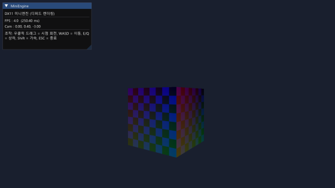
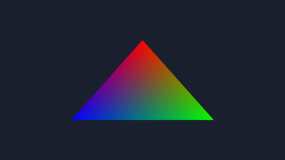
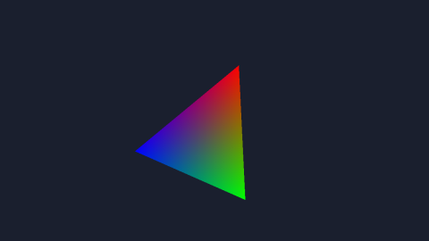
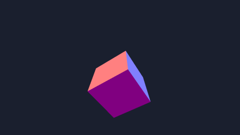
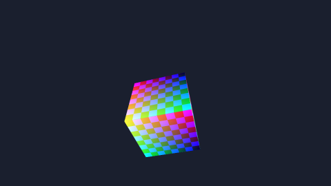
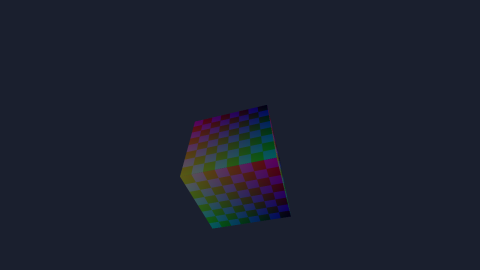
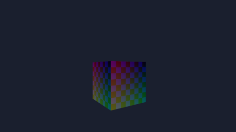
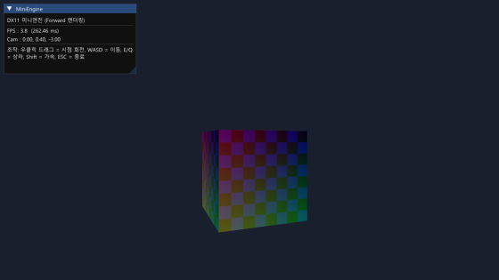
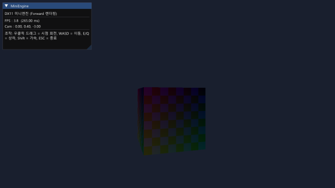

# DX11로 배우는 컴퓨터 그래픽스 — 통합본

> 모든 레슨을 한 페이지로 엮은 책 버전입니다. (생성: `python book/build_book.py`)


# 머리말 · 커리큘럼

## DX11로 배우는 컴퓨터 그래픽스

> 빈 화면에서 시작해 **디퍼드 렌더링된 텍스처 큐브 + 회전하는 3색 점광원 + ImGui 에디터 + 자유비행 카메라**까지,
> 한 줄씩 직접 쌓아 올리는 1:1 그래픽스 강의입니다.

이 저장소는 **대학교 1학년 수준**(자료구조까지 공부한 사람)을 대상으로 합니다.
DirectX, 선형대수, 그래픽스 이론을 처음 접해도 따라올 수 있도록 **이론 → 수학 → 코드** 순서로 차근차근 설명합니다.

---

### 이 강의의 약속

1. **하나씩.** 한 레슨은 하나의 개념만 다룹니다. 절대 한꺼번에 쏟아붓지 않습니다.
2. **왜부터.** "이 코드를 쳐라"가 아니라 "왜 이게 필요한가 → 수학적으로 무슨 일이 일어나는가 → 코드로는 이렇게 쓴다" 순서입니다.
3. **빌드되는 코드.** 각 레슨은 그 시점까지의 코드가 **실제로 빌드되고 실행되는** 상태입니다.
4. **직접 해보기.** 매 레슨 끝에는 손으로 풀거나 코드로 바꿔볼 연습 문제가 있습니다.

---

### 왜 DX12가 아니라 DX11인가?

이 강의의 최종 결과물은 동일한 디퍼드 렌더러지만, **입문용으로는 DX11이 훨씬 적합**합니다.

| | DX11 (이 강의) | DX12 |
|---|---|---|
| 명령 제출 | `ImmediateContext` 하나 — 그냥 그리면 됨 | 커맨드 리스트/얼로케이터 직접 관리 |
| 동기화 | `Present`가 알아서 | 펜스(Fence)로 손수 |
| 자원 바인딩 | 뷰를 직접 바인딩 | 디스크립터 힙 + 루트 시그니처 |
| GPU↔CPU 상태 | 드라이버가 처리 | 리소스 배리어 직접 |

즉 DX11은 **"그래픽스 개념"에 집중**하게 해주고, DX12는 거기에 **"GPU 자원 관리의 복잡함"**을 얹습니다.
개념을 먼저 DX11로 익히면 나중에 DX12로 넘어가기 훨씬 쉽습니다. (이 저장소의 모태가 된 DX12 엔진이 그 다음 단계입니다.)

---

### 수학 규약 (강의 전체 공통)

처음엔 의미를 몰라도 됩니다. Part 1에서 전부 설명합니다. 여기 적어두는 이유는 **"우리는 이 규약으로 일관되게 간다"**는 약속이기 때문입니다.

- **좌표계: 왼손 좌표계(Left-Handed, LH)** — +X 오른쪽, +Y 위, **+Z 화면 안쪽**.
- **행렬 저장: 행우선(row-major)** — 메모리에 한 행씩 차례로 저장.
- **벡터 규약: 행벡터(row-vector)** — 점에 행렬을 곱할 때 `v * M` 순서. HLSL에서는 `mul(v, M)`.
- 이 세 가지를 합치면 HLSL에서 `row_major`로 선언한 행렬을 **전치(transpose) 없이 그대로 업로드**할 수 있습니다.

---

### 커리큘럼

각 레슨에는 git 태그가 붙어 있어 `git checkout lesson-3.2` 처럼 그 시점의 코드 상태로 이동할 수 있습니다.

#### Part 0 — 준비: 큰 그림 그리기
| 레슨 | 제목 | 무엇을 얻나 |
|---|---|---|
| **0.1** | 그래픽스 파이프라인 한눈에 | "정점이 화면 픽셀이 되기까지"의 전체 흐름 |
| **0.2** | 좌표계와 공간들 | 모델→월드→뷰→클립 공간, 왜 행렬이 필요한가 |
| **0.3** | 개발 환경과 프로젝트 구조 | VS2022, 빌드, 이 저장소를 쓰는 법 |

#### Part 1 — 수학: 직접 만드는 선형대수
| 레슨 | 제목 | 무엇을 얻나 |
|---|---|---|
| **1.1** | 벡터 | 내적·외적의 기하학적 의미, `Vector2/3/4` 구현 |
| **1.2** | 행렬 | 행렬 곱, 항등/전치, `Matrix` 구현 |
| **1.3** | 변환 행렬 | 이동·회전·스케일, 합성 순서 |
| **1.4** | 뷰·투영·MVP | 카메라 행렬, 원근 투영, 최종 MVP 조립 |

#### Part 2 — 창과 입력 (Win32)
| 레슨 | 제목 | 무엇을 얻나 |
|---|---|---|
| **2.1** | Win32 창 띄우기 | 메시지 루프, WndProc thunk 패턴 |
| **2.2** | 입력 처리 | 키/마우스 facade, 델타, 캡처 |

#### Part 3 — 첫 삼각형 (DX11 입문)
| 레슨 | 제목 | 무엇을 얻나 |
|---|---|---|
| **3.1** | 디바이스와 화면 클리어 | Device/Context/SwapChain/RTV |
| **3.2** | 첫 삼각형 | 정점버퍼+셰이더+InputLayout |
| **3.3** | 상수 버퍼로 회전 | 행렬을 GPU로 (`mul(v,M)`) |

#### Part 4 — 3D 큐브 (Forward 렌더링)
| 레슨 | 제목 | 무엇을 얻나 |
|---|---|---|
| **4.1** | 큐브와 깊이 버퍼 | 인덱스버퍼, 깊이 테스트, MVP |
| **4.2** | 텍스처 입히기 | DDS 로딩, SRV, 샘플러, UV |
| **4.3** | 조명 (램버트) | `N·L`, 법선 변환, 앰비언트 |

#### Part 5 — 자유비행 카메라
| 레슨 | 제목 | 무엇을 얻나 |
|---|---|---|
| **5.1** | 자유비행 카메라 | yaw/pitch, 외적축, WASD, 짐벌락 |

#### Part 6 — ImGui 에디터
| 레슨 | 제목 | 무엇을 얻나 |
|---|---|---|
| **6.1** | ImGui 에디터 | 백엔드 통합, 메시지 후크, 입력 게이팅 |

#### Part 7 — 디퍼드 렌더링 (최종 목표)
| 레슨 | 제목 | 무엇을 얻나 |
|---|---|---|
| **7.1** | G-buffer와 지오메트리 패스 | MRT, 풀스크린 삼각형, 자원 hazard |
| **7.2** | 점광원과 최종 완성 | 거리 감쇠, 다중 점광원, 회전 3색 광원 |



---

### 📚 함께 보면 좋은 자료

- ****📖 책으로 읽기**** — 모든 레슨(코드+설명)을 한 권으로 엮은 책. `book/MiniEngine-DX11-Book.html`을 더블클릭하면 사이드바 목차·코드 하이라이트가 있는 오프라인 책이 열립니다. (`Ctrl+P`로 PDF 저장 가능)
- ****🧑‍🏫 AI 튜터 프롬프트**** — 새 AI 대화에서 이 저장소를 1:1 선생님과 공부하는 법. (학습자용)
- ****게임 수학 빠른 안내**** — 삼각함수/벡터/행렬이 가물가물하면 여기부터.

---

### 저장소 구조

```
dx11-graphics-course/
├─ README.md            ← 지금 이 파일 (전체 목차)
├─ TUTOR_PROMPT.md      ← AI 1:1 튜터로 공부하는 법
├─ MiniEngine.sln       ← Part 2~7 빌드 (VS2022)
├─ docs/                ← 레슨별 이론 설명 (마크다운 + 스크린샷)
│  ├─ 00-foundations/  01-math/  02-window/  03-triangle/
│  ├─ 04-cube/  05-camera/  06-imgui/  07-deferred/
│  └─ appendix/         ← 게임 수학 부록
├─ src/                 ← 강의가 진행되며 자라는 본체 코드
│  ├─ app/              ← 창, 입력, Application(메인 루프)
│  ├─ core/             ← DX11 디바이스, G-buffer
│  ├─ render/           ← 삼각형/큐브/디퍼드 렌더러, 카메라, 텍스처
│  ├─ editor/           ← ImGui 레이어, 에디터 패널
│  ├─ math/             ← 직접 만든 벡터/행렬 (Part 1)
│  └─ shaders/          ← HLSL (triangle/cube/gbuffer/lighting)
├─ examples/            ← Part 1 수학 콘솔 데모
├─ assets/              ← 텍스처(test.dds)
└─ third_party/imgui/   ← Dear ImGui (vendored)
```

### 시작하기

1. 이 저장소를 받습니다.
2. **Part 0.1**부터 **순서대로** 읽습니다. (수학 Part 1이 토대라 건너뛰지 마세요)
3. 빌드/실행:
   - **Part 1 (수학):** `examples/build_and_run.bat`
   - **Part 2~7 (그래픽스):** `MiniEngine.sln`을 VS2022로 열고 **F5**
4. 혼자 막히면 **AI 튜터 프롬프트**로 1:1 도움을 받으세요.

> 막히는 곳이 있으면 그 레슨의 "직접 해보기"와 "자주 막히는 곳"을 먼저 보세요.
> 수학이 약하면 **게임 수학 부록**부터.

---

### 빌드/실행 검증됨

모든 그래픽스 레슨(Part 3~7)은 실제로 빌드·실행해 화면 출력을 캡처하며 검증했습니다.
각 단계는 `MiniEngine.exe --smoke N`(N프레임 후 종료) / `--capture out.bmp`(렌더 결과 저장)로 확인할 수 있습니다.


---


# Part 0 — 준비: 큰 그림

## 0.1 그래픽스 파이프라인 한눈에

> **이 레슨의 목표:** 우리가 앞으로 몇 주 동안 만들 모든 것의 "지도"를 머릿속에 그립니다.
> 지금 모든 단어를 이해할 필요는 없습니다. 큰 흐름만 잡으세요.

---

### 1. 질문부터: 화면에 삼각형 하나가 어떻게 그려질까?

모니터는 작은 점(픽셀)들의 격자입니다. 예를 들어 1920×1080이면 약 200만 개의 픽셀이 있죠.
"3D 큐브를 그린다"는 건 결국 **이 200만 개 픽셀 각각에 무슨 색을 칠할지 정하는 일**입니다.

문제는 우리가 가진 건 "픽셀 색 목록"이 아니라 **3D 공간에 떠 있는 점 몇 개(정점, vertex)**라는 것입니다.
예를 들어 삼각형은 정점 3개로 정의됩니다:

```
       (0, 1, 0)
          /\
         /  \
        /    \
       /------\
(-1,-1,0)    (1,-1,0)
```

이 **3개의 점**을 **수백 개의 픽셀**로 바꾸는 일련의 과정 — 그게 바로 **그래픽스 파이프라인**입니다.

GPU(그래픽 카드)는 이 변환을 엄청나게 빠르게, 그것도 픽셀마다 **병렬로** 처리하는 데 특화된 칩입니다.

---

### 2. 큰 그림: CPU와 GPU의 역할 분담

```
┌─────────────── CPU (우리가 C++로 제어) ───────────────┐
│  · 정점 데이터 준비 (큐브의 꼭짓점들)                   │
│  · 변환 행렬 계산 (카메라, 회전 등)                     │
│  · "이걸 이 셰이더로 그려라" 명령을 GPU에 제출          │
└───────────────────────────┬──────────────────────────┘
                            │ 명령 + 데이터 전송
                            ▼
┌─────────────── GPU (우리가 HLSL 셰이더로 제어) ────────┐
│  정점들 → [파이프라인] → 픽셀 색 → 화면                 │
└──────────────────────────────────────────────────────┘
```

핵심: **우리는 두 군데에 코드를 씁니다.**
- **C++ (CPU):** 데이터를 준비하고 GPU에게 명령을 내림. ("이 정점 버퍼를, 이 셰이더로, 이렇게 그려줘")
- **HLSL (GPU):** 정점 하나하나, 픽셀 하나하나를 **어떻게** 처리할지 정하는 작은 프로그램(셰이더).

DirectX 11은 이 둘 사이의 **통역사(API)**입니다.

---

### 3. 파이프라인의 단계들

정점이 화면 픽셀이 되기까지 거치는 주요 단계입니다. 화살표를 따라가며 읽어보세요.

```
[정점 버퍼]          GPU 메모리에 올라간 큐브의 꼭짓점들
     │
     ▼
[① 정점 셰이더]      ★우리가 작성★ — 정점 하나마다 실행.
     │               3D 위치를 화면상의 위치로 변환 (MVP 행렬 곱).
     ▼
[② 래스터화]         GPU 고정 기능 — 삼각형 내부를 픽셀로 "채움".
     │               각 픽셀이 삼각형 어디쯤인지 보간값도 계산.
     ▼
[③ 픽셀 셰이더]      ★우리가 작성★ — 픽셀(조각, fragment) 하나마다 실행.
     │               이 픽셀의 최종 색을 결정 (텍스처, 조명 계산).
     ▼
[④ 출력 병합]        깊이 테스트(앞/뒤 판정), 블렌딩 후
     │               백버퍼(그릴 캔버스)에 기록.
     ▼
[화면에 표시]        Present — 다 그린 캔버스를 모니터로.
```

#### 단계별로 한 줄씩

| 단계 | 누가 | 무슨 일 |
|---|---|---|
| ① 정점 셰이더 (Vertex Shader) | **우리(HLSL)** | 3D 정점 위치를 화면 좌표로 변환. **여기서 수학(행렬)이 쓰임.** |
| ② 래스터화 (Rasterizer) | GPU 고정 기능 | 삼각형을 픽셀들로 쪼갬. 정점값을 픽셀마다 보간. |
| ③ 픽셀 셰이더 (Pixel Shader) | **우리(HLSL)** | 픽셀 색 결정. **여기서 텍스처·조명이 쓰임.** |
| ④ 출력 병합 (Output Merger) | GPU (우리가 설정) | 깊이 테스트, 블렌딩 → 백버퍼에 기록. |

> **★표시가 우리가 직접 작성하는 부분(셰이더)입니다.** 나머지는 GPU가 알아서 하되, 우리가 "이렇게 동작해라"고 **상태(state)를 설정**합니다.

---

### 4. 이 강의에서 우리가 만들 것과 파이프라인의 관계

앞으로 만들 기능들이 이 파이프라인의 어디에 해당하는지 미리 봅시다. (지금은 "아, 여기에 들어가는구나" 정도면 충분합니다.)

- **Part 1 (수학):** ① 정점 셰이더에서 쓸 **변환 행렬(MVP)**을 직접 계산하는 도구를 만듭니다.
- **Part 3 (삼각형):** 위 파이프라인을 **처음부터 끝까지 한 바퀴** 돌려 삼각형 하나를 띄웁니다.
- **Part 4 (큐브+텍스처+조명):** ③ 픽셀 셰이더에서 텍스처를 입히고 빛 계산을 합니다. ④에서 깊이 테스트로 앞면/뒷면을 가립니다.
- **Part 7 (디퍼드):** 파이프라인을 **두 번** 돕니다. 한 번은 정보(색·법선·위치)를 텍스처에 저장하고(지오메트리 패스), 또 한 번은 그 텍스처들을 읽어 조명을 계산합니다(라이팅 패스). 왜 그렇게 하는지는 Part 7에서 자세히.

---

### 5. 짚고 넘어갈 용어

이 강의 내내 나오는 단어들입니다. 지금 외울 필요는 없고, 나중에 헷갈리면 여기로 돌아오세요.

- **정점 (Vertex):** 3D 공간의 한 점. 위치뿐 아니라 법선·UV 같은 추가 정보도 담음.
- **메시 (Mesh):** 정점들 + "어떻게 삼각형으로 잇는지"(인덱스)의 묶음. 예: 큐브.
- **셰이더 (Shader):** GPU에서 도는 작은 프로그램. 정점 셰이더 / 픽셀 셰이더 등.
- **버퍼 (Buffer):** GPU 메모리의 데이터 덩어리. 정점 버퍼, 인덱스 버퍼, 상수 버퍼 등.
- **텍스처 (Texture):** 보통 이미지(2D 픽셀 격자). 표면에 입히거나, 중간 결과를 저장하는 데도 씀.
- **백버퍼 (Back Buffer):** 지금 그리는 중인 "보이지 않는 캔버스". 다 그리면 화면과 교체(Present).
- **래스터화 (Rasterization):** 삼각형 → 픽셀들로 변환하는 과정.

---

### 직접 해보기

코드는 아직 없습니다. 머릿속 모델만 점검합니다.

1. 1920×1080 화면에 삼각형 하나를 그릴 때, **정점 셰이더는 대략 몇 번** 실행될까요? **픽셀 셰이더는** 대략 몇 번 실행될까요? (정확한 수가 아니라 "왜 픽셀 셰이더가 훨씬 많이 도는가"를 설명해보세요.)
2. 빨간 큐브가 파란 큐브 **뒤에** 있습니다. 빨간 큐브의 가려진 부분이 화면에 안 보이게 만드는 단계는 위 ①~④ 중 어디일까요?
3. "텍스처 이미지를 표면에 입힌다"면, 그 색을 읽어 픽셀 색으로 정하는 일은 ①~④ 중 어디서 일어날까요?

> 정답 감각: (1) 정점 3번 vs 픽셀 수백~수천 번 — 삼각형이 덮는 픽셀마다 실행되니까. (2) ④ 출력 병합의 **깊이 테스트**. (3) ③ 픽셀 셰이더.

---

**다음 →** **0.2 좌표계와 공간들** — "3D 위치를 화면 좌표로 변환"이 정확히 무슨 뜻인지 파헤칩니다.


---

## 0.2 좌표계와 공간들

> **이 레슨의 목표:** "3D 위치를 화면 좌표로 변환한다"는 말의 정체를 밝힙니다.
> 큐브의 한 꼭짓점이 거치는 **여러 개의 좌표 공간**과, 공간을 바꿔주는 도구가 **행렬**이라는 것을 이해합니다.

---

### 1. 왜 좌표 공간이 여러 개나 필요할까?

영화 촬영을 떠올려봅시다.

- 배우는 자기 **몸을 기준**으로 "오른손을 든다"고 생각합니다. (배우 기준 = **모델 공간**)
- 그 배우는 **세트장 어딘가**에 서 있습니다. (세트 기준 = **월드 공간**)
- **카메라**가 그 장면을 특정 위치·각도에서 봅니다. (카메라 기준 = **뷰 공간**)
- 마지막으로 **필름(화면)**에 평평하게 찍힙니다. (화면 기준 = **클립/화면 공간**)

3D 그래픽스도 똑같습니다. 큐브의 한 꼭짓점은 이 네 공간을 **순서대로** 거치며 좌표가 바뀝니다.
각 단계에서 좌표를 바꿔주는 도구가 바로 **변환 행렬(transformation matrix)**입니다.

---

### 2. 왼손 좌표계 (이 강의의 규약)

3D 좌표축을 그리는 방법은 두 가지가 있습니다. 우리는 **왼손 좌표계(Left-Handed)**를 씁니다.

```
        +Y (위)
         │
         │
         │
         └────── +X (오른쪽)
        ╱
      ╱
   +Z (화면 안쪽으로 들어감)
```

- **+X** = 오른쪽
- **+Y** = 위
- **+Z** = **화면 안쪽** (당신에게서 멀어지는 방향)

> **왜 "왼손"?** 왼손 엄지를 +X, 검지를 +Y로 두면 중지가 자연스럽게 +Z(안쪽)를 가리킵니다.
> DirectX는 전통적으로 왼손 좌표계를 씁니다. (OpenGL은 오른손이라 +Z가 화면 바깥. 그래서 둘이 헷갈리는 거예요.)
> **중요한 건 일관성**입니다. 우리는 처음부터 끝까지 왼손으로 갑니다.

---

### 3. 한 꼭짓점이 거치는 여정

큐브의 한 꼭짓점 `(0.5, 0.5, 0.5)`가 화면 픽셀이 되기까지의 좌표 변화입니다.

```
[모델 공간]
큐브 자체 기준 좌표. 큐브 중심이 원점(0,0,0).
   꼭짓점 = (0.5, 0.5, 0.5)
        │
        │  × 모델 행렬 (World)  ── 큐브를 월드의 어디에, 얼마나 회전·확대해서 놓을까
        ▼
[월드 공간]
씬 전체의 공통 좌표. 카메라도, 빛도, 다른 물체도 여기 기준.
   꼭짓점 = (월드 어딘가의 위치)
        │
        │  × 뷰 행렬 (View)  ── 카메라를 원점에 두도록 온 세상을 옮김
        ▼
[뷰 공간]
카메라가 원점에서 +Z를 바라보는 기준. "카메라 눈" 좌표.
        │
        │  × 투영 행렬 (Projection)  ── 원근감을 주고, 화면 상자 안으로 밀어넣음
        ▼
[클립 공간]
화면에 그려질 표준 상자(-1~1) 기준. 여기서 삼각형이 잘림(clip).
        │
        │  (GPU가 자동으로) 화면 픽셀 좌표로
        ▼
[화면 공간]
실제 픽셀 위치. 예: (960, 540).
```

세 행렬 **M**(odel) → **V**(iew) → **P**(rojection)를 곱하는 것, 이게 그래픽스의 심장입니다.
이 셋을 합친 걸 **MVP 행렬**이라 부릅니다.

---

### 4. 행벡터 규약 — 곱하는 "순서"가 중요하다

여기서 이 강의의 두 번째 규약이 나옵니다. 점에 행렬을 곱할 때 **점을 왼쪽**에 둡니다.

```
변환된 점 = 점 × M × V × P       ← 우리 규약 (행벡터, row-vector)
```

왼쪽에서 오른쪽으로 자연스럽게 읽힙니다: "점을, 모델 변환하고, 뷰 변환하고, 투영한다."

> 일부 교재(특히 수학책, OpenGL)는 반대로 `P × V × M × 점` (열벡터)로 씁니다. 결과는 같지만 **행렬의 저장 방식과 곱하는 순서가 뒤집힙니다.**
> 둘을 섞으면 큐브가 안 보이거나 뒤집히는 버그의 단골 원인입니다. **우리는 행벡터 `v × M`으로 통일**합니다.
> HLSL 셰이더에서는 이게 `mul(v, M)`으로 나타납니다. (Part 4에서 직접 봅니다.)

이 규약과 "행우선 저장"을 합치면, CPU에서 만든 행렬을 셰이더로 보낼 때 **전치(뒤집기)가 필요 없다**는 실용적 이점이 있습니다. 자세한 건 Part 1.2와 1.4에서.

---

### 5. 왜 4×4 행렬인가? (3D인데 왜 4차원?)

큐브는 3D인데 행렬은 4×4입니다. 한 칸이 더 있죠. 이유:

**이동(translation)은 3×3 행렬로 표현할 수 없습니다.** 회전·스케일은 되는데, "+5만큼 옮기기"는 안 됩니다.
그래서 좌표에 가짜 4번째 성분 `w=1`을 붙여 `(x, y, z, 1)`로 만들고, 4×4 행렬을 씁니다.
이렇게 하면 이동도 **행렬 곱 한 번으로** 통일해서 처리할 수 있습니다. 이걸 **동차 좌표(homogeneous coordinates)**라고 부릅니다.

추가 보너스: `w`는 나중에 **원근 나눗셈(perspective divide)**에도 쓰입니다. 멀리 있는 물체가 작게 보이는 효과가 바로 이 `w`로 나누는 데서 나옵니다. (Part 1.4)

지금은 이렇게만 기억하세요:
- **위치(점)**는 `w = 1` → 이동의 영향을 받음.
- **방향(법선 같은)**은 `w = 0` → 이동의 영향을 안 받음(방향은 평행이동해도 그대로니까).

---

### 직접 해보기

종이에 그려보세요.

1. 왼손 좌표계에서, 화면 **오른쪽 위 안쪽**을 가리키는 방향 벡터의 부호 `(±, ±, ±)`는?
2. 카메라가 월드 좌표 `(0, 0, -5)`에 있고 +Z(안쪽)를 봅니다. 원점에 있는 큐브는 카메라 **앞**에 있을까요, **뒤**에 있을까요?
3. "점에 모델 행렬만 곱하면 어떤 공간의 좌표가 되는가? 뷰 행렬까지 곱하면?" — 위 4번 여정 그림을 안 보고 답해보세요.
4. 방향 벡터(예: 빛이 오는 방향)에 **이동 행렬**을 적용하면 안 되는 이유를, `w=0`과 연결해 한 문장으로 설명해보세요.

> 정답 감각: (1) `(+, +, +)`. (2) 앞(+Z 방향에 큐브가 있으니까). (3) 모델만 → 월드 공간, 뷰까지 → 뷰 공간. (4) 방향은 위치가 없으므로 평행이동하면 안 되고, `w=0`이면 행렬의 이동 성분이 곱해져도 0이 되어 무시됨.

---

**다음 →** **0.3 개발 환경과 프로젝트 구조** — 도구를 갖추고 코드를 만질 준비를 합니다.


---

## 0.3 개발 환경과 프로젝트 구조

> **이 레슨의 목표:** 코드를 만질 도구를 갖추고, 이 저장소를 **어떻게 따라가는지** 익힙니다.
> 이론은 잠깐 쉬고, 손을 풉니다.

---

### 1. 필요한 도구

| 도구 | 용도 | 비고 |
|---|---|---|
| **Visual Studio 2022** (Community) | C++ 컴파일러 + 디버거 | "C++를 사용한 데스크톱 개발" 워크로드 설치 |
| **Windows 10/11 SDK** | DirectX 11 헤더/라이브러리 | VS2022 워크로드에 포함됨 |
| **Git** | 레슨별 코드 상태 이동 | 태그로 시점 이동 |

> DirectX 11은 **Windows에 기본 내장**되어 있습니다. 별도 SDK 다운로드(DX12의 Agility SDK 같은)가 **필요 없습니다.** 이것도 DX11이 입문에 편한 이유 중 하나예요.

VS2022 설치 시 "**C++를 사용한 데스크톱 개발**" 워크로드 하나만 체크하면 이 강의에 필요한 컴파일러·Windows SDK·DirectX가 모두 들어옵니다.

---

### 2. 이 저장소를 따라가는 법 — 레슨별 git 태그

이 강의의 코드는 **하나의 저장소가 점점 자라는** 방식입니다. 각 레슨이 끝나는 시점마다 git **태그**가 붙어 있습니다.

```bash
# 어떤 레슨들이 있는지 보기
git tag

# 특정 레슨 시점의 코드 상태로 이동 (예: 1.2 행렬까지)
git checkout lesson-1.2

# 이번 레슨에서 코드가 무엇이 바뀌었는지 보기
git diff lesson-1.1 lesson-1.2

# 최신(전체)로 돌아오기
git checkout main
```

> **이게 왜 좋은가:** "삼각형이 처음 떴을 때 코드가 어땠지?"가 궁금하면 `git checkout lesson-3.3` 한 줄이면 됩니다.
> 그리고 `git diff`로 **"이 레슨이 정확히 무엇을 더했는가"**를 한눈에 볼 수 있습니다. 실제 그래픽스 엔진이 자라는 과정을 그대로 따라가는 셈이죠.

권장 학습 흐름:
1. 레슨 문서(`docs/`)를 읽는다.
2. 해당 태그로 `checkout`해서 그 시점 코드를 본다.
3. `examples/`의 프로그램을 직접 빌드·실행한다.
4. "직접 해보기"를 푼다.

---

### 3. 저장소 구조

```
dx11-graphics-course/
├─ README.md            ← 전체 목차. 길을 잃으면 여기로.
├─ docs/                ← 레슨별 이론 (지금 읽는 이런 문서들)
│  ├─ 00-foundations/   ← Part 0
│  └─ 01-math/          ← Part 1
├─ src/                 ← 강의가 진행되며 자라는 "본체" 코드
│  └─ math/             ← Part 1에서 만드는 벡터/행렬 라이브러리
│     ├─ Vector2.h / .cpp
│     ├─ Vector3.h / .cpp
│     ├─ Vector4.h / .cpp
│     ├─ Matrix.h  / .cpp
│     └─ MathCommon.h
└─ examples/            ← 각 Part를 직접 실행해보는 작은 프로그램
   └─ math_demo.cpp     ← Part 1: 벡터/행렬이 정말 동작하는지 눈으로 확인
```

- **`src/`** 는 우리가 만드는 엔진의 **본체**입니다. Part가 진행될수록 폴더(`app/`, `render/` 등)가 늘어납니다.
- **`examples/`** 는 본체를 **써보는** 코드입니다. "라이브러리(src) vs 그걸 쓰는 프로그램(examples)" 분리는 실제 프로젝트의 흔한 구조이고, 학습에도 좋습니다.

---

### 4. Part 1 코드 빌드·실행하기

Part 1(수학)은 창도, GPU도 필요 없습니다. **순수 C++ 콘솔 프로그램**이라 가장 간단하게 빌드됩니다.
앞으로 Win32 창과 DX11이 등장하는 Part 2~3부터는 Visual Studio 솔루션(`.sln`)을 추가할 거예요. 지금은 명령 한 줄이면 충분합니다.

#### 방법 A — "Developer Command Prompt for VS 2022"에서

VS2022를 설치하면 시작 메뉴에 **"Developer Command Prompt for VS 2022"**가 생깁니다. 이걸 열면 `cl`(컴파일러)이 바로 동작합니다.

```bat
:: 저장소 폴더로 이동한 뒤
cl /EHsc /std:c++20 /I src examples\math_demo.cpp src\math\*.cpp /Fe:math_demo.exe
math_demo.exe
```

- `/std:c++20` — C++20 표준 사용
- `/I src` — `#include "math/Vector3.h"`가 `src/` 기준으로 찾아지도록 포함 경로 추가
- `/Fe:` — 만들 실행 파일 이름

#### 방법 B — 제공된 빌드 스크립트

같은 명령을 담은 **`examples/build_and_run.bat`**을 더블클릭하거나 실행하면 됩니다. (Developer Command Prompt가 아니어도 내부에서 VS 환경을 잡아줍니다.)

성공하면 콘솔에 벡터·행렬 연산 결과가 주르륵 출력됩니다. Part 1을 따라가며 이 출력이 **왜 그렇게 나오는지** 하나씩 이해하게 됩니다.

---

### 5. 막히면

- **`cl`을 찾을 수 없다고 나옴** → 일반 명령 프롬프트가 아니라 **"Developer Command Prompt for VS 2022"**를 열었는지 확인. 또는 방법 B의 `.bat` 사용.
- **헤더를 못 찾음(`Cannot open include file`)** → `/I src` 옵션이 있는지, 저장소 루트 폴더에서 실행했는지 확인.
- **무슨 태그가 있는지 모르겠다** → `git tag` 로 목록 확인.

---

### 직접 해보기

1. VS2022를 설치하고 "Developer Command Prompt for VS 2022"를 열어 `cl` 이라고 쳐보세요. 컴파일러 버전이 출력되면 준비 완료입니다.
2. `git tag` 를 실행해 현재 어떤 레슨 태그들이 있는지 확인해보세요.
3. (지금은 코드가 적지만) `git checkout lesson-0.3` 처럼 이 레슨 태그로 이동했다가 `git checkout main`으로 돌아와 보세요. 태그 이동에 익숙해지면 강의가 훨씬 편해집니다.

---

**Part 0 완료!** 큰 그림(0.1), 좌표 공간(0.2), 도구(0.3)를 갖췄습니다.
이제 진짜 코드를 만집니다.

**다음 →** **1.1 벡터** — 모든 그래픽스 수학의 출발점.


---


# Part 1 — 수학

## 1.1 벡터

> **이 레슨의 목표:** 그래픽스의 가장 기본 재료인 **벡터**를 기하학적으로 이해하고,
> 특히 **내적(dot)**과 **외적(cross)**이 "무슨 의미"인지 — 공식이 아니라 **그림과 유도**로 — 손에 익힙니다. 그리고 직접 `Vector3`를 구현합니다.
>
> **코드:** **`src/math/Vector3.h`** · **`Vector3.cpp`** · 데모 **`examples/math_demo.cpp`**
> **태그:** `git checkout lesson-1.1`
>
> 수학이 오래돼서 가물가물하면 **게임 수학 부록**을 옆에 띄워두세요.

---

### 1. 벡터란 정확히 무엇인가?

벡터는 그냥 **숫자 몇 개의 묶음**입니다. 3D 벡터는 `(x, y, z)` 세 숫자죠. 그런데 같은 묶음이 **두 가지 의미**로 쓰입니다. 이 구분이 그래픽스 수학의 첫 단추입니다.

#### (a) 위치(점, position)

공간의 **한 지점**. "원점에서 여기까지 와라"는 뜻으로 읽습니다.

```
        y
        │       ● (2, 3)  ← "오른쪽으로 2, 위로 3 간 지점"
        │      ╱
        │     ╱
        │    ╱  (원점에서 그은 화살표의 '끝점')
────────┼──────── x
        │
```

예: 큐브의 꼭짓점 `(0.5, 0.5, 0.5)`.

#### (b) 방향(direction / displacement)

**화살표 그 자체** — "어디를 향하는가, 얼마나 가는가". 출발점은 상관없고 **방향과 길이**만 의미가 있습니다.

```
방향 (2, 1) 은 "어디서 출발하든 오른쪽 2, 위 1 만큼" 이라는 똑같은 화살표:

    ╱→        ╱→
   (여기서도)  (저기서도) 같은 벡터
```

예: 빛이 오는 방향 `(0.4, 0.8, 0.3)`, 면이 바라보는 방향(법선).

> **왜 이 구분이 중요한가:** 코드에서는 둘 다 `Vector3`로 똑같이 생겼지만, **변환할 때 다르게 다뤄야** 합니다.
> 위치는 이동(평행이동)의 영향을 받고, 방향은 받지 않습니다. (Part 0.2의 `w=1` vs `w=0`, Part 1.3에서 코드로 확인)
> 지금은 "같은 타입이지만 **내가 의미를 알고 써야 한다**"만 기억하세요.

---

### 2. 기본 연산 — 성분별 계산 (그림으로)

대부분의 연산은 **같은 자리끼리** 계산합니다. 그런데 각각 기하학적 의미가 있습니다.

#### 덧셈: 화살표 이어 붙이기

```
a + b = (ax+bx, ay+by, az+bz)
```

기하학적으로는 **a 끝에 b를 이어 붙인** 지점입니다(평행사변형 법칙).

```
        ┌────────►  a+b
       ╱          ╱
      ╱ b        ╱
     ╱          ╱
    └──── a ───►
```

#### 뺄셈: "한 점에서 다른 점으로 가는 방향"

```
b - a = (bx-ax, by-ay, bz-az)
```

이건 **그래픽스에서 가장 자주 나오는 패턴**입니다. 외워두세요:

> **`목표 - 시작 = 시작에서 목표로 향하는 방향`**

```
  a ●─────────► b
      (b - a)       ← a에서 b로 가는 화살표
```

예: "표면에서 빛으로 가는 방향" = `빛위치 - 표면위치`. (Part 4 조명, Part 7 점광원에서 바로 씁니다.)

#### 스칼라배: 길이만 조절 (방향 유지)

```
a * 2   = 길이 2배, 방향 그대로
a * 0.5 = 길이 절반
a * -1  = 방향 정반대  (= -a)
```

```cpp
Vector3 Vector3::operator+(const Vector3& v) const { return { x+v.x, y+v.y, z+v.z }; }
Vector3 Vector3::operator-(const Vector3& v) const { return { x-v.x, y-v.y, z-v.z }; }
Vector3 Vector3::operator*(float s) const          { return { x*s, y*s, z*s }; }
```

---

### 3. 길이와 정규화

#### 길이 = 피타고라스

벡터의 **길이(크기, magnitude)**는 직각삼각형의 빗변입니다.

```
|v| = √(x² + y² + z²)
```

```
2D 예: v = (3, 4)
   |v| = √(3² + 4²) = √(9+16) = √25 = 5
```

```cpp
float Vector3::Length() const { return std::sqrt(Dot(*this)); }   // √(v·v) = |v|
```

> **`Length`가 `Dot(*this)`를 쓰는 이유:** `v·v = x²+y²+z²` 이므로 `√(v·v) = |v|`. 내적의 첫 응용입니다(아래 4번에서 내적을 배우면 다시 와서 보세요).

#### 정규화 = 길이를 1로

방향만 필요할 때(예: "빛이 어느 쪽?")는 길이를 1로 맞춥니다. 이걸 **정규화(normalize)**, 결과를 **단위 벡터(unit vector)**라 합니다.

```
normalize(v) = v / |v|        길이로 나누면 방향은 그대로, 길이만 1
```

```
예: v = (3, 4, 0),  |v| = 5
    normalize(v) = (3/5, 4/5, 0) = (0.6, 0.8, 0)
    확인: |(0.6, 0.8, 0)| = √(0.36 + 0.64) = √1 = 1  ✓
```

```cpp
Vector3 Vector3::Normalized() const {
    float len = Length();
    if (len <= 1e-8f) return { 0, 0, 0 };   // 0벡터는 방향이 없음 → 0으로 (0 나눗셈 방지)
    return { x / len, y / len, z / len };
}
```

> **왜 0 검사를 하나?** 길이가 0인 벡터를 정규화하면 0으로 나누기(NaN/무한대)가 됩니다. 그래픽스 버그의 흔한 원인이라 습관처럼 막아둡니다.

---

### 4. ★ 내적 (Dot Product) — "얼마나 같은 방향인가"

이번 레슨에서 **가장 중요한 개념**입니다. 조명·카메라·컬링 등 어디에나 나옵니다. 두 가지 얼굴을 모두 이해해야 합니다.

#### 얼굴 1: 계산 공식

```
a · b = ax·bx + ay·by + az·bz       (결과는 숫자 하나, 벡터 아님!)
```

#### 얼굴 2: 기하학적 의미 (★진짜 중요)

```
a · b = |a| |b| cos θ                (θ = 두 벡터 사이의 각)
```

두 벡터가 **단위 벡터**(`|a|=|b|=1`)라면:

```
a · b = cos θ
```

즉 내적은 **두 방향이 얼마나 나란한지**를 -1 ~ 1 숫자로 알려줍니다.

| 두 단위 벡터의 관계 | θ | cos θ = a·b |
|---|---|---|
| 같은 방향 | 0° | **1** |
| 60° | 60° | 0.5 |
| 수직(직각) | 90° | **0** |
| 120° | 120° | -0.5 |
| 반대 방향 | 180° | **-1** |

> **핵심 직관:** 내적의 부호만 봐도 알 수 있습니다.
> **양수 = 같은 쪽(예각), 0 = 수직, 음수 = 반대 쪽(둔각).**

#### 두 얼굴은 왜 같은가? (유도 — 투영으로 이해)

내적을 **"b를 a 방향에 비춘 그림자 × |a|"** 로 보면 직관이 옵니다.

```
        b
       ╱│
      ╱ │
     ╱  │
    ╱ θ │
   └────┴──────► a
   |←──→|
    b의 a방향 그림자 = |b| cos θ

a · b = |a| × (b의 a방향 그림자) = |a| × |b| cos θ
```

성분 공식 `ax·bx + ay·by + az·bz`가 이 값과 같다는 건, 각 축(서로 수직인 단위벡터)에서의 투영을 더한 것이기 때문입니다. (엄밀한 증명은 코사인 법칙으로도 가능 — **부록**)

#### 손으로 풀어보기

```
a = (1, 0, 0),  b = (1, 1, 0)
a · b = 1·1 + 0·1 + 0·0 = 1
|a| = 1,  |b| = √2,  so cos θ = 1 / (1·√2) = 0.707  →  θ = 45°
(그림으로도 (1,0)과 (1,1)은 정확히 45° 차이 ✓)
```

```cpp
float Vector3::Dot(const Vector3& v) const { return x*v.x + y*v.y + z*v.z; }
```

> **★ 미리 보는 응용 (Part 4 조명):** 표면 법선 `N`과 빛 방향 `L`이 둘 다 단위 벡터일 때,
> `N · L`은 "빛이 표면을 얼마나 정면으로 때리는가"입니다. 정면(1)이면 밝고, 빗겨가면(0) 어둡고, 등지면(<0) 빛을 못 받습니다.
> 이게 가장 기본 조명 공식인 **램버트(Lambert) 모델**이고, `saturate(dot(N, L))`로 셰이더에 등장합니다.
> 그래서 N과 L을 꼭 **정규화**해야 합니다 — 안 그러면 `|N||L|`이 1이 아니라 cosθ만 안 남고 밝기가 엉뚱해집니다.

---

### 5. ★ 외적 (Cross Product) — "둘 다에 수직인 방향"

내적은 결과가 **숫자**였지만, 외적은 결과가 **벡터**입니다.

#### 계산 공식 (행렬식 기억법)

```
a × b = (ay·bz - az·by,
         az·bx - ax·bz,
         ax·by - ay·bx)
```

외우기 어렵죠. **"빠진 축으로 순환"** 패턴으로 기억합니다. x성분을 구할 땐 x를 빼고 y,z만; y성분은 y 빼고 z,x; z성분은 z 빼고 x,y (xyzxyz 순환):

```
결과.x = ay·bz - az·by      (y,z 사용)
결과.y = az·bx - ax·bz      (z,x 사용)
결과.z = ax·by - ay·bx      (x,y 사용)
```

#### 기하학적 의미 3가지

**① 방향: a, b 둘 다에 수직**

```
        a × b  (위로 솟음)
          ↑
          │
          └───────→ b
         ╱
        a
```

**② 크기: 두 벡터가 만드는 평행사변형의 넓이**

```
|a × b| = |a| |b| sin θ
```

(내적은 `cos`, 외적 크기는 `sin` — 짝을 이룹니다. 나란할수록 외적은 0, 수직일수록 최대.)

**③ 어느 쪽으로 솟나? — 좌표계의 손 방향**

왼손 좌표계에서 우리 축들은 이렇게 맞물립니다:

```
Right × Up = Forward       (1,0,0) × (0,1,0) = (0,0,1)
```

손계산으로 확인:
```
(1,0,0) × (0,1,0):
  x = 0·0 - 0·1 = 0
  y = 0·0 - 1·0 = 0
  z = 1·1 - 0·0 = 1     →  (0, 0, 1) = Forward  ✓
```

```cpp
Vector3 Vector3::Cross(const Vector3& v) const {
    return { y*v.z - z*v.y,  z*v.x - x*v.z,  x*v.y - y*v.x };
}
```

> **★ 주의: 순서가 중요!** `a × b = -(b × a)` — 순서를 바꾸면 방향이 정반대가 됩니다.
> Part 5에서 카메라의 "오른쪽" 방향을 `up × forward`로 만드는데, 순서를 틀리면 화면이 좌우로 뒤집힙니다. 단골 버그예요.

> **★ 미리 보는 응용:** 삼각형의 두 변을 외적하면 그 면의 **법선**이 나옵니다. 카메라 좌표축(right/up/forward)을 만들 때도 외적을 씁니다(Part 1.4, 5).

---

### 6. 코드 둘러보기 & 실행

**`Vector3.h`**에는 자주 쓰는 방향 상수도 정의해 뒀습니다.

```cpp
static Vector3 Right()   { return { 1, 0, 0 }; }   // +X
static Vector3 Up()      { return { 0, 1, 0 }; }   // +Y
static Vector3 Forward() { return { 0, 0, 1 }; }   // +Z (화면 안쪽)
```

빌드·실행 (자세한 방법은 **0.3**):

```bat
examples\build_and_run.bat
```

출력에서 `Right . Up = 0`(수직), `Right x Up = (0,0,1)`(Forward) 같은 결과가 **왜 그렇게 나오는지** 위 설명과 맞춰보세요.

---

### 직접 해보기

손으로 풀고, 데모를 고쳐 확인해보세요. (정답은 맨 아래)

1. `(2, 0, 0)`과 `(0, 3, 0)`의 내적은? 두 벡터의 사이각은 몇 도일까요?
2. `(1, 1, 0)`을 정규화하면? (힌트: 길이가 √2)
3. `(1, 2, 2)`의 길이는? 정규화하면?
4. `a=(1,0,0)`, `b=(1,1,0)`일 때 `a·b`로 사이각의 cos를 구하고, 각을 추정해보세요.
5. `Up × Right`를 계산하면 `(0,0,?)`. 부호가 `Right × Up`과 어떻게 다른가요? 외적의 순서 성질로 설명해보세요.
6. 두 벡터가 **수직**인지 코드로 어떻게 판정할까요? (힌트: 내적)
7. (코드) `math_demo.cpp`에 빛 방향 `L = (0.4, 0.8, 0.3)`을 정규화한 뒤, 법선 `N = Up`과의 내적 `N·L`을 출력하는 줄을 추가해보세요. 0~1 사이로 나오면 "빛이 위에서 비스듬히 내려온다"는 뜻입니다.

<details>
<summary>정답 보기</summary>

1. `0`, 90°. (서로 수직)
2. `(1/√2, 1/√2, 0) ≈ (0.707, 0.707, 0)`.
3. 길이 `√(1+4+4)=√9=3`. 정규화 `(1/3, 2/3, 2/3)`.
4. `a·b = 1`, `cosθ = 1/(1·√2) ≈ 0.707` → θ ≈ 45°.
5. `(0,0,-1)`, 즉 `Right×Up`의 반대 — 순서를 바꾸면 부호가 뒤집힘.
6. 내적이 0(또는 부동소수 오차로 거의 0)이면 수직.
7. `N·L = 0.8/|L| = 0.8/√(0.16+0.64+0.09) ≈ 0.8/0.943 ≈ 0.85`.
</details>

---

**다음 →** **1.2 행렬** — 벡터를 변환하는 도구를 만듭니다.


---

## 1.2 행렬

> **이 레슨의 목표:** 행렬이 **"벡터를 변환하는 함수"**라는 관점을 확실히 잡고, 우리 규약(행우선 저장 + 행벡터 `v*M`)으로
> `Matrix`를 구현합니다. 행렬 **곱**과 **전치**의 의미를 손계산으로 이해합니다.
>
> **코드:** **`src/math/Matrix.h`** · **`Matrix.cpp`**
> **태그:** `git checkout lesson-1.2` · 변화 보기: `git diff lesson-1.1 lesson-1.2`

---

### 1. 행렬은 "변환"이다

행렬을 숫자 격자로만 보면 막막합니다. 그래픽스에서는 이렇게 보세요:

> **행렬 = 벡터를 넣으면 변환된 벡터가 나오는 상자(함수).**

```
   v  ──►[ M ]──►  v'
 (원래 점)        (옮겨지거나 회전된 점)
```

"옮기기·회전·확대·원근 투영" — 이 모든 변환을 **똑같은 형식(행렬 곱)**으로 표현할 수 있다는 게 행렬의 힘입니다.
이번 레슨은 그 그릇(행렬 곱)을 만들고, 1.3에서 실제 변환들을 채웁니다.

#### 행렬-벡터 곱의 진짜 의미: "기저의 행방"

가장 깊은 직관 하나. 행렬의 각 행(우리 규약에선 행)은 **"원래 축이 어디로 가는지"**를 말합니다.

```
v * M  를 펼치면:
  v = (x, y, z, w) 일 때
  결과 = x·(M의 1행) + y·(M의 2행) + z·(M의 3행) + w·(M의 4행)
```

즉 **결과는 행렬의 행들을 v의 성분으로 가중합(선형결합)한 것**입니다.
"x축 방향 성분 x는 M의 1행이 가리키는 새 방향으로, y는 2행 방향으로..." 이렇게 각 축을 새 위치로 보내 더하는 거죠. 1.3에서 변환 행렬을 만들 때 이 관점이 핵심이 됩니다.

---

### 2. 우리 규약: 행우선 저장 + 행벡터

0.2에서 약속한 두 규약을 코드로 못박습니다. 처음엔 헷갈리니 천천히.

#### (1) 행우선 저장(row-major) — 메모리에 한 행씩

```
        열0   열1   열2   열3
행0:    _11   _12   _13   _14
행1:    _21   _22   _23   _24
행2:    _31   _32   _33   _34
행3:    _41   _42   _43   _44

메모리(연속): _11 _12 _13 _14 _21 _22 _23 _24 _31 ... (한 행을 다 쓰고 다음 행)
```

```cpp
union {
    struct { float _11,_12,_13,_14,  _21,_22,_23,_24,  _31,_32,_33,_34,  _41,_42,_43,_44; };
    float m[4][4];          // m[행][열] 로도 접근
};
```

> `union` 덕분에 같은 16개 float를 이름(`_23`)으로도, 인덱스(`m[1][2]`)로도 가리킵니다. (`_23` = 2행 3열 = `m[1][2]`. 이름은 1부터, 인덱스는 0부터라 헷갈리지 마세요.)

#### (2) 행벡터(row-vector) — 점을 왼쪽에 두고 `v * M`

```
            ┌                ┐
[x y z w] × │   M (4x4)      │  =  [x' y' z' w']
            └                ┘
  1x4            4x4               1x4
```

```cpp
// 결과의 j번째 성분 = Σ_i  v_i · m[i][j]   (v와 M의 j열을 내적)
Vector4 operator*(const Vector4& v, const Matrix& mat) {
    return {
        v.x*mat._11 + v.y*mat._21 + v.z*mat._31 + v.w*mat._41,   // x'
        v.x*mat._12 + v.y*mat._22 + v.z*mat._32 + v.w*mat._42,   // y'
        v.x*mat._13 + v.y*mat._23 + v.z*mat._33 + v.w*mat._43,   // z'
        v.x*mat._14 + v.y*mat._24 + v.z*mat._34 + v.w*mat._44    // w'
    };
}
```

> **관찰:** 결과의 각 성분은 `v`와 행렬의 **한 열**을 내적한 것입니다. 1.1의 내적이 여기서도 등장하죠.

#### 행벡터 vs 열벡터 — 왜 둘로 갈리나

| | 행벡터 (이 강의) | 열벡터 (많은 수학책/OpenGL) |
|---|---|---|
| 곱 순서 | `v * M` (점이 왼쪽) | `M * v` (점이 오른쪽) |
| 변환 합성 | `M1 * M2` = "먼저 M1" | `M2 * M1` = "먼저 M1" |
| 같은 변환의 행렬 | 서로 **전치** 관계 |

둘은 **결과가 같지만 표기와 행렬 저장이 뒤집힙니다.** 두 관례를 섞으면 큐브가 안 보이거나 뒤집히는 버그의 단골 원인입니다. **우리는 행벡터 `v*M`으로 끝까지 통일**합니다. (이 선택의 보상은 1.4에서 — 셰이더에 전치 없이 그대로 업로드)

---

### 3. 항등 행렬 (Identity)

곱셈에서 `1`처럼, **아무것도 바꾸지 않는** 행렬입니다. 대각선만 1.

```
1 0 0 0
0 1 0 0      v * I = v   (확인: 결과.x = x·1 + y·0 + z·0 + w·0 = x ✓)
0 0 1 0
0 0 0 1
```

모든 변환의 출발점이자, "행렬을 안전하게 초기화하는 기본값"입니다. 그래서 우리 `Matrix`의 기본 생성자는 항등 행렬로 시작합니다.

```cpp
Matrix::Matrix() {                 // 대각선만 1, 나머지 0 — 필드를 직접 채움
    _11=1; _12=0; _13=0; _14=0;
    _21=0; _22=1; _23=0; _24=0;
    _31=0; _32=0; _33=1; _34=0;
    _41=0; _42=0; _43=0; _44=1;
}
Matrix Matrix::Identity() { return Matrix(); }   // 명시적으로 읽히게 쓰고 싶을 때
```

> **🐛 실제로 겪은 함정:** 처음엔 `Matrix() { *this = Identity(); }`로 짰는데, `Identity()`가 내부에서 `Matrix r;`를 만들면
> **생성자 → Identity → 생성자 → ...** 무한 재귀가 되어 실행 즉시 **스택 오버플로(`0xC00000FD`)**로 죽었습니다.
> 그래서 기본 생성자는 `Identity()`를 부르지 않고 **필드를 직접** 채웁니다. "기본값이 자기 자신을 만드는 함수를 부르면 위험하다"는 좋은 교훈이에요.

---

### 4. ★ 행렬 곱 — 변환을 합치기

행렬의 진짜 위력: **두 변환을 곱하면, 한 번에 적용되는 하나의 변환이 됩니다.**

```
C = A · B           C[i][j] = Σ_k A[i][k] · B[k][j]
                              = (A의 i행) · (B의 j열)
```

말로는 어려우니 **2×2로 손계산**해봅시다.

```
A = | 1  2 |     B = | 5  6 |
    | 3  4 |         | 7  8 |

C[0][0] = A 0행 · B 0열 = 1·5 + 2·7 = 5 + 14 = 19
C[0][1] = A 0행 · B 1열 = 1·6 + 2·8 = 6 + 16 = 22
C[1][0] = A 1행 · B 0열 = 3·5 + 4·7 = 15 + 28 = 43
C[1][1] = A 1행 · B 1열 = 3·6 + 4·8 = 18 + 32 = 50

A·B = | 19  22 |
      | 43  50 |
```

코드도 정확히 이 규칙(i행 × k × j열)입니다.

```cpp
Matrix Matrix::operator*(const Matrix& rhs) const {
    Matrix r;
    for (int i = 0; i < 4; ++i)
        for (int j = 0; j < 4; ++j) {
            float sum = 0.0f;
            for (int k = 0; k < 4; ++k)
                sum += m[i][k] * rhs.m[k][j];
            r.m[i][j] = sum;
        }
    return r;
}
```

#### ★ 곱의 순서 = 적용 순서

행벡터 규약에서 이게 핵심 직관입니다.

```
v * (A * B)  ==  (v * A) * B          (결합법칙)
```

즉 `A * B`는 **"먼저 A, 그 다음 B"**를 적용하는 변환입니다. 왼쪽에서 오른쪽으로 읽으면 됩니다.
그래서 우리의 MVP가 `Model * View * Projection` 순서인 거예요 — 점을 모델 변환하고, 뷰 변환하고, 투영. (1.3, 1.4에서 직접)

#### ★ 순서를 바꾸면 결과가 달라진다 (비가환)

```
위의 A, B로 B·A 를 계산하면:
B·A = | 5·1+6·3  5·2+6·4 |   = | 23  34 |
      | 7·1+8·3  7·2+8·4 |     | 31  46 |

A·B = | 19 22 |  ≠  B·A = | 23 34 |        ← 완전히 다름!
      | 43 50 |          | 31 46 |
```

**행렬 곱은 교환법칙이 성립하지 않습니다(`A·B ≠ B·A`).** "회전 후 이동"과 "이동 후 회전"이 다른 것과 같습니다. 변환 순서 버그의 근원이니, 항상 "왼쪽부터 차례로 적용"을 떠올리세요. (1.3에서 눈으로 확인합니다.)

---

### 5. 전치 (Transpose)

행과 열을 맞바꿉니다. `T[i][j] = src[j][i]`.

```
| 1 2 3 4 |              | 1 0 0 0 |
| 0 1 0 0 |   transpose  | 2 1 0 0 |
| 0 0 1 0 |     ───►     | 3 0 1 0 |
| 0 0 0 1 |              | 4 0 0 1 |
   (첫 '행' 1,2,3,4 가 →  첫 '열'이 됨)
```

```cpp
Matrix Matrix::Transpose(const Matrix& src) {
    Matrix r;
    for (int i = 0; i < 4; ++i)
        for (int j = 0; j < 4; ++j)
            r.m[i][j] = src.m[j][i];
    return r;
}
```

알아두면 좋은 성질:
- `(Aᵀ)ᵀ = A` (두 번 전치하면 원래대로)
- `(A·B)ᵀ = Bᵀ·Aᵀ` (곱의 전치는 순서가 뒤집힘 — 행벡터/열벡터 관례가 전치 관계인 이유)

> **지금 당장은 안 쓰지만 왜 미리 만드나?** 다른 관례(열벡터)로 쓰인 행렬을 우리 규약으로 바꿀 때, 그리고 **"행렬을 셰이더에 어떻게 올리는가"**를 이해할 때 필요합니다.
> 우리 규약(행우선 + 행벡터 + HLSL `row_major`)에서는 **업로드 시 전치가 필요 없다**는 게 장점인데, 그걸 제대로 이해하려면 전치가 무엇인지 알아야 하죠. (Part 1.4, 3.3에서 다시 만납니다.)

---

### 6. 실행

```bat
examples\build_and_run.bat
```

`=== Part 1.2 행렬 ===` 섹션에서 `p * I == p`(항등), 그리고 전치가 행↔열을 바꾸는 것을 확인하세요.

---

### 직접 해보기

1. `v = (2, 0, 0, 1)`에 항등 행렬을 곱하면? 손으로 `operator*` 공식을 따라가 보세요.
2. `A = [[1,2],[3,4]]`, `B = [[0,1],[1,0]]`일 때 `A·B`와 `B·A`를 각각 손계산해 둘이 다름을 확인하세요. (`B`는 "두 성분을 맞바꾸는" 행렬 — 결과를 보고 의미를 추측해보세요.)
3. 어떤 2×2 행렬을 곱하면 벡터의 x,y가 서로 바뀔까요? (힌트: `[[0,1],[1,0]]`을 v에 적용)
4. `(A·B)ᵀ = Bᵀ·Aᵀ`를 2번의 A,B로 직접 확인해보세요.
5. 우리 규약에서 `v * (A * B)`가 "먼저 A, 그 다음 B"인 이유를, `(v*A)*B`로 바꿔 설명해보세요.

<details>
<summary>정답 보기</summary>

1. `(2,0,0,1)` 그대로.
2. `A·B = [[2,1],[4,3]]`, `B·A = [[3,4],[1,2]]` — 다름. `B`는 곱하는 쪽의 행/열을 맞바꾸는 효과.
3. `[[0,1],[1,0]]`. `(x,y)·M = (y, x)`.
5. 결합법칙으로 묶음만 바꾼 것이고, v에 A를 먼저 적용한 결과에 B를 적용하므로 순서가 A→B.
</details>

---

**다음 →** **1.3 변환 행렬** — 빈 그릇에 이동·회전·스케일을 채웁니다.


---

## 1.3 변환 행렬

> **이 레슨의 목표:** 1.2에서 만든 빈 그릇에 **이동·회전·스케일** 변환을 채웁니다.
> 각 변환 행렬을 **"기저 벡터가 어디로 가는가"**에서 직접 **유도**하고, **합성 순서**가 왜 결과를 바꾸는지 손계산으로 확인합니다.
>
> **코드:** **`src/math/Matrix.cpp`** (변환 함수들) · 데모 **`examples/math_demo.cpp`**
> **태그:** `git checkout lesson-1.3` · 변화 보기: `git diff lesson-1.2 lesson-1.3`

---

### 0. 핵심 도구: "기저 벡터의 행방"으로 행렬 만들기

변환 행렬을 외우지 말고 **유도**합시다. 방법은 하나입니다:

> **"x축 단위벡터 `(1,0,0)`은 어디로 가는가? y축 `(0,1,0)`은? z축 `(0,0,1)`은?"**
> 그 도착지들을 행렬의 행(우리 행벡터 규약)에 적으면 끝.

왜? 1.2에서 봤듯 `v * M = x·(1행) + y·(2행) + z·(3행) + ...` 이라, 1행은 곧 "x축이 가는 곳"이기 때문입니다. 이 한 가지로 모든 변환 행렬을 만들 수 있습니다.

---

### 1. 스케일 — 대각선 (가장 쉬움)

"각 축을 sx, sy, sz배 늘려라". x축 `(1,0,0)` → `(sx,0,0)`, y축 → `(0,sy,0)`, z축 → `(0,0,sz)`. 그대로 행에 적으면:

```
sx  0   0   0
0   sy  0   0          (x,y,z,1) * S = (x·sx, y·sy, z·sz, 1)
0   0   sz  0
0   0   0   1
```

```cpp
Matrix Matrix::Scaling(const Vector3& s) {
    Matrix r;
    r._11 = s.x; r._22 = s.y; r._33 = s.z;
    return r;
}
```

---

### 2. 이동 — 왜 맨 아래 행인가

이동은 회전·스케일과 달리 **선형 변환이 아닙니다**(원점이 안 움직이면 이동을 표현 못 함). 그래서 `w=1` 트릭을 씁니다(동차 좌표, 0.2 복습).

행벡터 규약 `v * M`에서, 이동량은 행렬의 **맨 아래 행(4행)**에 들어갑니다. 4행은 "w축(=1)이 가는 곳"이고, w=1이라 항상 그 값이 통째로 더해지기 때문입니다.

```
        1   0   0   0
T  =    0   1   0   0
        0   0   1   0
        tx  ty  tz  1
```

`(x, y, z, 1) * T`를 펼치면:

```
결과.x = x·1 + y·0 + z·0 + 1·tx = x + tx
결과.y = ... = y + ty
결과.z = ... = z + tz
결과.w = x·0 + y·0 + z·0 + 1·1 = 1
→ (x+tx, y+ty, z+tz, 1)
```

> **여기서 `w`의 역할이 드러납니다.** 마지막 성분이 1이라서 `1·tx = tx`가 더해집니다.
> 만약 방향 벡터처럼 `w=0`이면 `0·tx = 0` — 이동이 무시됩니다. (이게 "방향은 평행이동의 영향을 안 받는다"의 정체. 6번에서 코드로 확인)

```cpp
Matrix Matrix::Translation(const Vector3& t) {
    Matrix r;                       // 항등에서 시작
    r._41 = t.x; r._42 = t.y; r._43 = t.z;
    return r;
}
```

---

### 3. ★ 회전 — 단위원에서 유도

회전이 가장 어렵게 느껴지지만, **1.1의 삼각함수(단위원)**에서 바로 나옵니다. Z축 회전(가장 직관적, z는 고정하고 x-y 평면에서 회전)을 유도해봅시다.

"기저의 행방"을 적용합니다. x축 `(1,0)`을 θ만큼 돌리면 단위원 위에서 `(cosθ, sinθ)`로 갑니다. y축 `(0,1)`은 그보다 90° 앞서 있으니 `(-sinθ, cosθ)`로 갑니다.

```
x축 (1,0) → (cosθ,  sinθ)      ← 1행
y축 (0,1) → (-sinθ, cosθ)      ← 2행
```

이걸 행에 적으면:

```
 cos θ   sin θ   0   0
-sin θ   cos θ   0   0          Z축은 그대로(3행 = 0,0,1)
   0       0     1   0
   0       0     0   1
```

`(1, 0, 0)`을 90° 회전하면 (cos90=0, sin90=1):

```
x' = 1·cos90 + 0·(-sin90) = 0
y' = 1·sin90 + 0·cos90    = 1     →  (1,0,0) 이 (0,1,0) 으로!
```

데모에서 정확히 `Rz(90): (1,0,0) → (0,1,0)`이 나옵니다. **+X 위의 점이 +Y로 돌아간** 거죠.

```cpp
Matrix Matrix::RotationZ(float a) {
    float c = std::cos(a), s = std::sin(a);
    Matrix r;
    r._11 =  c; r._12 = s;
    r._21 = -s; r._22 = c;
    return r;
}
```

X축·Y축 회전도 똑같은 방법으로, **고정되는 축만 다릅니다**:
- **RotationX**: x 고정, y-z 평면에서 회전 (`_22,_23,_32,_33`에 cos/sin)
- **RotationY**: y 고정, z-x 평면에서 회전 (`_11,_13,_31,_33`에 cos/sin)

(**`Matrix.cpp`**에서 셋을 비교해보세요. 패턴이 똑같습니다.)

> **회전 행렬의 성질:** 회전은 길이를 안 바꾸므로 행들이 서로 **수직인 단위벡터**입니다(정규직교). 이런 행렬의 역행렬은 놀랍게도 **전치와 같습니다**(`R⁻¹ = Rᵀ`). 1.4 뷰 행렬에서 이 성질을 씁니다.

> **라디안 주의:** `std::cos/sin`은 **라디안**을 받습니다. 90도를 그냥 넣으면 안 되고 `ToRadians(90)`으로 바꿔야 합니다. (각도 단위 실수도 흔한 버그)

---

### 4. ★ 합성 — 순서가 결과를 바꾼다

여러 변환을 **곱해서** 하나로 합칩니다. 1.2의 핵심을 다시:

> 행벡터 규약에서 `v * (A * B) = (v * A) * B` → **`A * B`는 "먼저 A, 그 다음 B"**.

데모로 직접 비교합니다. 점 `(1,0,0)`에 대해:

```
Rz * T  (먼저 90도 회전, 그 다음 +5 이동):
   (1,0,0) ──회전──► (0,1,0) ──이동──► (5,1,0)

T * Rz  (먼저 +5 이동, 그 다음 90도 회전):
   (1,0,0) ──이동──► (6,0,0) ──회전──► (0,6,0)
```

```
→ Rz then T = (5.000, 1.000, 0.000)
→ T then Rz = (0.000, 6.000, 0.000)     ← 완전히 다른 결과!
```

**같은 두 변환인데 순서만 바꿨더니 점이 전혀 다른 곳에 갑니다.** 1.2에서 손계산으로 본 `A·B ≠ B·A`가 **눈에 보이는 차이**로 나타난 것입니다.

#### 모델 행렬의 표준 순서: 스케일 → 회전 → 이동

```cpp
Matrix world = Scaling(s) * RotationY(angle) * Translation(pos);
//              먼저 크기,    그 다음 회전,        마지막에 위치
```

**왜 이 순서?** 물체를 원점에서 키우고(스케일), 원점 기준으로 돌리고(회전), 마지막에 제자리로 옮기면(이동) 직관과 맞습니다.

순서를 바꾸면 어떤 일이 생기는지 봅시다:
- `Translation * Scaling`(이동 먼저, 스케일 나중): 물체가 원점에서 멀어진 뒤 스케일되면, **위치까지 같이 늘어나** 물체가 원점에서 더 멀리 날아갑니다.
- `Translation * RotationY`(이동 먼저, 회전 나중): 물체가 제자리에서 도는 게 아니라 **원점을 중심으로 궤도를 그리며** 돕니다. (점광원이 큐브를 도는 효과를 이걸로 만들 수도 있어요 — Part 7과 비교!)

---

### 5. 역변환 — 되돌리기

변환을 **취소**하려면 역행렬을 곱합니다. 다행히 기본 변환들의 역은 외우기 쉽습니다.

| 변환 | 역변환 |
|---|---|
| `Translation(t)` | `Translation(-t)` (반대로 이동) |
| `Scaling(s)` | `Scaling(1/s)` (역수배) |
| `RotationZ(θ)` | `RotationZ(-θ)` (반대로 회전) = 전치 |

그리고 합성의 역은 **순서가 뒤집힙니다**: `(A·B)⁻¹ = B⁻¹·A⁻¹`. ("양말 신고 신발 신었으면, 벗을 땐 신발 먼저 벗는다" 비유)

> 뷰 행렬(1.4)이 사실 "카메라 변환의 역"입니다 — 카메라를 원점으로 되돌리는 변환이죠. 그래서 회전의 역=전치 성질이 거기서 쓰입니다.

---

### 6. 점 vs 방향 — 변환 편의 함수

같은 행렬이라도 **점**과 **방향**은 다르게 변환해야 합니다. 2번에서 본 `w`의 차이입니다.

```cpp
Vector3 TransformPoint(const Vector3& p, const Matrix& m) {
    return (Vector4{ p, 1.0f } * m).ToVector3DivW();   // w=1: 이동 영향 받음
}
Vector3 TransformDirection(const Vector3& d, const Matrix& m) {
    return (Vector4{ d, 0.0f } * m).XYZ();             // w=0: 이동 무시
}
```

데모에서 방향 `(1,0,0)`에 이동 행렬을 적용해도 `(1,0,0)` 그대로인 걸 확인하세요. **빛의 방향, 법선** 같은 건 항상 방향으로 변환해야 합니다.

> **법선의 함정 예고:** 사실 비균등 스케일(예: x만 2배)이 있으면 법선은 월드 행렬이 아니라 그 **역전치(inverse-transpose)**로 변환해야 정확합니다. 우리 큐브는 회전만 해서 괜찮지만, 이 주제는 Part 4.3과 PBR 단계에서 다시 만납니다.

---

### 직접 해보기

1. `(0,1,0)`을 `RotationZ(90도)`로 변환하면 어디로 갈까요? "기저의 행방"으로 예측한 뒤 데모로 확인.
2. `Scaling(3)` 후 `Translation(1,0,0)`(즉 `Scaling*Translation`)을 점 `(1,0,0)`에 적용하면? 손으로: ×3 → (3,0,0), +1 → (4,0,0).
3. 2번에서 순서를 뒤집으면(`Translation * Scaling`) 결과는? (+1 먼저 → (2,0,0), ×3 → (6,0,0))
4. `RotationX(90도)`의 행렬을 "기저의 행방"으로 직접 유도해보세요. (y축은 어디로? z축은?)
5. `Translation(5,0,0) * RotationY(t)`를 매 프레임 적용하면 물체가 어떻게 움직일까요? (궤도? 제자리 회전?)
6. 법선 벡터를 `TransformPoint`로 변환하면 어떤 문제가 생길지, `w=1` vs `w=0`으로 설명해보세요.

<details>
<summary>정답 보기</summary>

1. `(-1,0,0)`.
2. `(4,0,0)`. 3. `(6,0,0)`.
4. y축 `(0,1,0)`→`(0,cos,sin)`, z축 `(0,0,1)`→`(0,-sin,cos)`. x는 고정.
5. 원점을 중심으로 **궤도**를 그리며 회전(이동 먼저 → 회전이 위치까지 돌림).
6. 점으로 변환하면 이동 성분이 더해져 "방향"이 엉뚱해짐 — 방향은 `w=0`이어야 함.
</details>

---

**다음 →** **1.4 뷰·투영·MVP** — 카메라와 원근을 더해 드디어 "화면 좌표"를 완성합니다.


---

## 1.4 뷰 · 투영 · MVP

> **이 레슨의 목표:** 카메라(뷰 행렬)와 원근(투영 행렬)을 **유도**해서, 0.2에서 본 **모델→월드→뷰→클립** 여정을
> 코드로 완성합니다. 멀리 있는 물체가 작아지는 **원근감의 정체(÷w)**를 닮은꼴 삼각형으로 직접 증명합니다.
>
> **코드:** **`src/math/Matrix.cpp`** (`LookToLH`, `PerspectiveFovLH`) · 데모 **`examples/math_demo.cpp`**
> **태그:** `git checkout lesson-1.4` · 변화 보기: `git diff lesson-1.3 lesson-1.4`
>
> 이번 레슨은 수식이 가장 많습니다. 막히면 천천히, 한 행렬씩. 게임 수학이 약하면 **부록**을 옆에.

---

### 1. 다시 보는 여정 — 이제 코드로

```
점 ──(Model)──► 월드 ──(View)──► 뷰 ──(Projection)──► 클립 ──(÷w)──► NDC ──► 화면
```

- **Model (1.3):** 큐브를 월드의 원하는 곳에 배치.
- **View (이번 2번):** 카메라 기준으로 세상을 옮김.
- **Projection (이번 3번):** 원근감을 주고 화면 상자로 밀어넣음.
- **÷w (이번 4번):** GPU가 자동으로 해주지만, 원리를 유도합니다.

세 행렬을 곱한 게 **MVP**, 정점 셰이더가 하는 일이 딱 `clip = v * MVP` 한 줄입니다.

---

### 2. ★ 뷰 행렬 — "카메라를 원점으로" 유도

핵심 발상: GPU는 항상 **원점에 있는 가상의 눈**에서 렌더링합니다. 그런데 우리 카메라는 `(0,1,-4)` 같은 곳에서 어딘가를 봅니다. 그래서 뷰 행렬은 **"카메라가 원점에서 +Z를 보도록 온 세상을 반대로 변환"**합니다. 즉 **카메라 변환의 역**입니다.

#### 2단계로 분해

카메라를 원점·정렬 상태로 되돌리려면:
1. **이동**: 세상을 `-eye`만큼 옮김 (카메라를 원점으로).
2. **회전**: 카메라 축(right/up/forward)을 표준 축(X/Y/Z)에 정렬.

#### 카메라 축 만들기 (1.1 외적 활용)

카메라가 보는 방향 `forward`와 대략적인 `up`이 주어지면, 서로 수직인 깔끔한 축 3개를 만듭니다.

```cpp
Vector3 zaxis = forward.Normalized();           // 앞 (카메라가 보는 방향)
Vector3 xaxis = up.Cross(zaxis).Normalized();   // 오른쪽 = 위 × 앞   (왼손!)
Vector3 yaxis = zaxis.Cross(xaxis);             // 진짜 위 = 앞 × 오른쪽
```

> **왜 `up`을 그대로 안 쓰고 다시 계산?** 사용자가 준 `up`은 대략적 "위"라 `forward`와 정확히 수직이 아닐 수 있습니다.
> 외적으로 `right`를 구하고, 다시 외적으로 **forward에 정확히 수직인 진짜 up**을 만듭니다. 이렇게 셋이 서로 수직(정규직교)인 좌표축이 됩니다.

#### 회전 부분: 왜 축이 "열"로 들어가나

월드의 한 점을 카메라 축 기준 좌표로 바꾸는 건 **그 점을 각 카메라 축에 투영(내적)**하는 것입니다. "카메라 기준 x좌표 = (점)·(xaxis)". 이 투영을 행렬로 쓰면 카메라 축들이 **열(column)**에 배치됩니다(회전 행렬은 정규직교라 그 역=전치, 그래서 축이 행이 아니라 열로 들어감).

#### 이동 부분: -eye를 각 축에 투영

이동(`-eye`)과 회전을 합치면, 맨 아래 행에 `-eye`를 각 축에 투영한 값이 들어갑니다.

```cpp
Matrix r;
r._11=xaxis.x; r._12=yaxis.x; r._13=zaxis.x;    // 축을 '열'로
r._21=xaxis.y; r._22=yaxis.y; r._23=zaxis.y;
r._31=xaxis.z; r._32=yaxis.z; r._33=zaxis.z;
r._41=-xaxis.Dot(eye); r._42=-yaxis.Dot(eye); r._43=-zaxis.Dot(eye);  // -eye 투영
r._44=1;
```

> **검산 직관:** 카메라 위치 `eye`를 이 뷰 행렬로 변환하면 정확히 원점 `(0,0,0)`이 나와야 합니다. (eye가 카메라 자신이니까.) 한번 대입해 확인해보세요 — 회전으로 eye를 각 축에 투영한 값에서 `-eye·축`을 더하면 0이 됩니다.

> **순서 주의 (단골 버그):** `up.Cross(zaxis)`와 `zaxis.Cross(up)`은 정반대 방향(1.1). 틀리면 화면이 좌우로 뒤집힙니다. 우리 규약(왼손)에서 `right = up × forward`.

---

### 3. ★ 투영 행렬 — 닮은꼴 삼각형에서 유도

원근의 본질은 **"멀수록 화면에서 중앙으로 모인다"**입니다(철길이 멀리서 한 점으로). 이걸 닮은꼴 삼각형으로 유도해봅시다.

#### 핵심: 화면에 비친 위치 = x / z

카메라(원점)에서 거리 `z`에 있는 점의 높이 `y`를, 카메라 앞 거리 `n`(near 평면)의 화면에 투영하면:

```
       점 (y, z)
        ●
       ╱│
      ╱ │ y
     ╱  │
    ╱___│________ 광축(z축)
   눈   화면(z=n)
   |←n→|
   투영된 높이 y' : y' / n = y / z   (닮은꼴 삼각형)
   →  y' = n · y / z
```

**핵심 결론:** 투영된 좌표는 **z로 나눠집니다**(`y' = n·y/z`). 멀수록(z 큼) 작아지죠. 이 "z로 나누기"가 원근의 전부입니다.

#### 행렬 + ÷w로 "z 나누기" 구현하기

행렬 곱만으로는 나눗셈을 못 합니다. 그래서 영리한 트릭: 결과의 **w에 z를 넣어두고**, 나중에 GPU가 **÷w**(원근 나눗셈)를 하게 합니다. 이게 `_34 = 1`의 정체입니다.

```cpp
float yScale = 1.0f / tan(fovY * 0.5f);   // 아래 '시야각' 참고
float xScale = yScale / aspect;            // 화면 가로:세로 비율 보정

         xScale  0       0                 0
P  =     0       yScale  0                 0
         0       0       zf/(zf-zn)        1     ← _34 = 1 (★ z를 w로 복사)
         0       0       -zn·zf/(zf-zn)    0
```

`(x,y,z,1) * P`를 계산하면 결과의 w 성분은:

```
w' = x·0 + y·0 + z·1 + 1·0 = z      ← 뷰 공간 깊이가 w로!
```

그리고 나중에 `÷w` 하면 `x'/w = x'/z`, `y'/w = y'/z` — 위에서 유도한 "z로 나누기"가 실현됩니다.

#### 시야각(FOV)과 yScale = cot(fov/2)

`yScale`은 시야각에서 나옵니다. 화면 위쪽 가장자리가 시야각 절반(`fov/2`)에 해당하고, near 평면에서의 높이가 `n·tan(fov/2)`. 이를 NDC의 `±1`로 정규화하면 스케일이 `1/tan(fov/2) = cot(fov/2)`가 됩니다.

```
시야각 좁음(망원) → tan 작음 → yScale 큼 → 물체 크게(확대)
시야각 넓음(광각) → tan 큼   → yScale 작음 → 물체 작게(많이 담음)
```

`xScale = yScale / aspect`는 화면이 가로로 길어도(aspect>1) 정사각형이 안 찌그러지게 보정합니다(3.3의 삼각형 보정과 같은 원리).

#### near/far와 z 매핑

3행·4행의 `zf/(zf-zn)`, `-zn·zf/(zf-zn)`는 뷰 공간 깊이 `z ∈ [near, far]`를 ÷w 후 NDC 깊이 `[0, 1]`로 매핑합니다(near→0, far→1). 이 값이 깊이 버퍼(Part 4.1)에 저장돼 앞/뒤를 가립니다.

> **near/far 팁:** 둘의 비(far/near)가 너무 크면 깊이 정밀도가 near 쪽에 몰려 멀리서 z-fighting(깜빡임)이 생깁니다. near를 너무 작게(예: 0.001) 잡지 않는 게 좋습니다.

---

### 4. ★ ÷w — 데모로 증명

데모에서 같은 x좌표(=1)를 가진, 깊이만 다른 두 점을 MVP로 변환합니다.

```
가까운 점 z=0 :  w = 4.00      (카메라가 -4에 있으니 뷰 공간 깊이 4)
먼   점 z=8 :  w = 12.00      (뷰 공간 깊이 12)
```

**w가 정확히 "카메라로부터의 거리(뷰 공간 깊이)"**가 됐습니다 — 3번에서 `_34=1`로 의도한 그대로죠. 그리고 ÷w:

```
가까운 점:  NDC.x = 1.×.../4  → 0.339
먼   점:  NDC.x = 1.×.../12 → 0.113     ← 같은 x=1 인데 화면에선 중앙에 가깝게(작게)
```

```cpp
Vector3 Vector4::ToVector3DivW() const {
    if (w == 0.0f) return { x, y, z };
    return { x / w, y / w, z / w };
}
```

> **GPU가 대신 해줍니다.** 실제 렌더링에서 정점 셰이더는 `clip`(÷w 전)을 출력하고, GPU 래스터라이저가 ÷w를 자동으로 합니다.
> 우리는 셰이더에서 `mul(v, MVP)`만 쓰면 됩니다(Part 3~4). 하지만 **왜 그게 동작하는지** 이제 유도까지 했습니다.

---

### 5. ★ MVP 조립 + 수치 완주

이제 전부 합칩니다. 행벡터 규약이라 **왼쪽부터 적용 순서**대로:

```cpp
Matrix mvp = model * view * proj;        // 점을 모델→뷰→투영
Vector4 clip = Vector4{ pos, 1.0f } * mvp;
```

데모의 꼭짓점 `(0.5, 0.5, 0.5)`가 거치는 변화 (카메라 `(0,1,-4)`, fov 45°, 16:9):

```
모델공간 (0.5, 0.5, 0.5, 1)
   │ × Model (여기선 Identity)
월드공간 (0.5, 0.5, 0.5, 1)
   │ × View   (카메라 기준으로)
뷰공간   (대략 x≈0.5, y≈-0.5, z≈4.5)   ← 카메라보다 약간 아래·앞
   │ × Proj
클립공간 (0.679, -1.207, 4.404, 4.500)   ← w=4.5 = 뷰 깊이!
   │ ÷ w
NDC      (0.151, -0.268, 0.979)          ← -1~1 안 = 화면에 보임
```

이 `mvp` 행렬이 곧 Part 3~4의 정점 셰이더에 상수 버퍼로 올라가고, HLSL에서 이렇게 쓰입니다:

```hlsl
cbuffer Transform { row_major float4x4 gMVP; };
o.pos = mul(float4(input.pos, 1.0f), gMVP);   // 우리가 만든 v * MVP 그대로!
```

> **규약의 보상(1.2의 약속):** 처음부터 "행우선 저장 + 행벡터"로 통일했기에, CPU에서 만든 `mvp`를 **전치 없이 그대로** GPU에 올려
> HLSL `row_major` + `mul(v, M)`로 쓸 수 있습니다. 열벡터 관례였다면 업로드 때마다 전치해야 했을 겁니다.

---

### 6. Part 1 정리

축하합니다. 그래픽스 수학의 **뼈대 전체**를 유도까지 하며 만들었습니다.

```
벡터(1.1) → 행렬(1.2) → 변환(1.3) → 뷰·투영·MVP(1.4)
  내적/외적   곱/합성     이동·회전     카메라·원근·÷w
   (그림자)    (손계산)    (기저 유도)   (닮은꼴 유도)
```

이 `Math` 라이브러리는 앞으로 **고치지 않고 계속 씁니다.** Part 3에서 삼각형, Part 4에서 큐브, Part 7 디퍼드까지 여기서 만든 `mvp`와 `dot`이 그대로 GPU로 갑니다.

---

### 직접 해보기

1. 카메라를 `(0,1,-4)`에서 `(0,1,-8)`로 멀리 옮기면, 꼭짓점의 `clip.w`는 커질까요 작아질까요? 예측 후 데모로 확인.
2. 시야각 `fovY`를 45도→90도로 넓히면 `yScale`(=cot(fov/2))은 어떻게 변하고, 물체는 화면에서 커 보일까요 작아 보일까요?
3. 카메라 위치 `eye`를 뷰 행렬로 변환하면 어떤 점이 나와야 할까요? (2번 검산 직관)
4. `near/far`를 `0.1/100`에서 `1/10`으로 바꾸면 깊이 정밀도 관점에서 무엇이 좋아질까요?
5. 왜 `model * view * proj` 순서이고 `proj * view * model`이 아닌지, 1.2의 "곱 = 적용 순서"로 설명해보세요.
6. `_34`를 1이 아니라 0으로 바꾸면(원근 끔) 어떤 투영이 될까요? (힌트: w가 항상 1 → ÷w가 무의미 → 멀어도 안 작아짐 = 정사영/직교투영)

<details>
<summary>정답 보기</summary>

1. 더 멀어졌으니 w(거리)가 커짐.
2. `tan(45°)=1`, `tan(45°)`(90도의 절반)도 1이라... 정확히는 fov 90이면 tan(45)=1 → yScale=1(45도일 땐 cot(22.5)≈2.41). fov 넓힐수록 yScale 작아지고 물체 작아 보임(넓게 담음).
3. 원점 (0,0,0).
4. near를 키우면(0.1→1) far와의 비가 줄어 깊이 정밀도가 고르게 분포(z-fighting 감소).
6. 원근 없는 **직교(orthographic) 투영** — 멀어도 크기 그대로(설계도/2D UI에 씀).
</details>

---

**Part 1 완료!** 다음은 **Part 2 — 창과 입력(Win32)**입니다. 드디어 화면에 창을 띄웁니다.

**다음 →** **2.1 Win32 창 띄우기**


---


# Part 2 — 창과 입력

## 2.1 Win32 창 띄우기

> **이 레슨의 목표:** 화면에 **빈 창 하나**를 띄우고, 그 창이 죽지 않고 계속 살아있게(메인 루프) 만듭니다.
> Windows에서 창이 **메시지로 움직인다**는 핵심 개념을 익힙니다.
>
> **코드:** **`src/app/Win32Window.h`** · **`Win32Window.cpp`** · **`main.cpp`**
> **태그:** `git checkout lesson-2.1`

---

### 0. 이제 Visual Studio 솔루션입니다

Part 1까지는 콘솔 프로그램이라 `cl` 한 줄로 빌드했죠. Part 2부터는 **창**이 필요하므로 정식 VS 솔루션을 씁니다.

- 빌드: `MiniEngine.sln`을 VS2022로 열고 **F5** (또는 아래 명령)
- 명령줄 빌드:
  ```
  MSBuild.exe MiniEngine.sln /p:Configuration=Debug /p:Platform=x64
  ```
- 실행 파일: `build\Debug\MiniEngine.exe`

> 프로젝트 설정 두 가지가 중요합니다(이미 `.vcxproj`에 들어있음): **`/utf-8`**(한글 주석), **`/std:c++20`**. 그리고 콘솔 창이 안 뜨도록 **Windows 서브시스템 + `main()` 진입점**으로 설정했습니다.

---

### 1. 큰 그림: 창은 "메시지"로 산다

데스크톱 프로그램의 핵심 모델은 이렇습니다.

```
사용자가 뭔가 함(클릭, 키, 창 이동, 닫기)
        │
        ▼
  OS가 그 사건을 "메시지"로 만들어 우리 창의 큐에 넣음
        │
        ▼
  우리는 루프를 돌며 큐에서 메시지를 꺼내 처리 (WndProc)
```

창을 만드는 일은 결국 **(1) 창을 등록·생성**하고 **(2) 이 메시지 루프를 끝없이 도는** 것입니다.

---

### 2. 창 만들기 3단계

**`Win32Window::Create`**는 세 단계입니다.

**① 윈도우 클래스 등록** — "이런 타입의 창을 만들 거야"를 OS에 알림. 가장 중요한 필드는 `lpfnWndProc`(메시지 처리 함수).

```cpp
WNDCLASSEXW wc{};
wc.lpfnWndProc   = &Win32Window::WndProcThunk;   // 메시지가 여기로 옴
wc.lpszClassName = kWindowClassName;
RegisterClassExW(&wc);
```

**② 클라이언트 영역 보정** — 우리가 원하는 1280×720은 "그림 그릴 안쪽" 크기인데, 창에는 제목표시줄·테두리가 있죠. 그만큼 더 크게 만들어야 안쪽이 정확히 1280×720이 됩니다.

```cpp
RECT rc{ 0, 0, 1280, 720 };
AdjustWindowRect(&rc, WS_OVERLAPPEDWINDOW, FALSE);   // 테두리 포함 전체 크기로 보정
```

**③ 창 생성 + 표시**

```cpp
m_hwnd = CreateWindowExW(..., this);   // 마지막 인자 this 가 핵심 (아래 4번)
ShowWindow(m_hwnd, SW_SHOW);
```

---

### 3. ★ 메인 루프 — PeekMessage

게임/그래픽스 프로그램의 심장입니다.

```cpp
bool Win32Window::PumpMessages() {
    MSG msg{};
    while (PeekMessageW(&msg, nullptr, 0, 0, PM_REMOVE)) {
        if (msg.message == WM_QUIT) return false;   // 창 닫힘 → 종료
        TranslateMessage(&msg);
        DispatchMessageW(&msg);                     // → WndProc 호출
    }
    return true;
}
```

> **왜 `GetMessage`가 아니라 `PeekMessage`?**
> `GetMessage`는 메시지가 올 때까지 **멈춰서 기다립니다**(블로킹). 일반 앱(메모장)엔 좋지만, 우리는 메시지가 없어도 **매 프레임 계속 화면을 그려야** 합니다.
> `PeekMessage`는 큐가 비어 있으면 바로 `false`를 돌려줘서, 루프가 멈추지 않고 렌더링으로 넘어갈 수 있습니다.

메인 루프(`Application::Run`)는 이렇게 됩니다:

```cpp
while (m_window.PumpMessages()) {   // 메시지 처리 (창 닫히면 false)
    Frame(dt, time);               // 한 프레임 그리기/갱신
}
```

---

### 4. ★ WndProc과 thunk 패턴 (C++ 멤버 함수 함정)

Windows가 요구하는 메시지 처리 함수는 **C 스타일 정적 함수**여야 합니다. 그런데 우리는 멤버 변수(`m_width` 등)에 접근하는 **멤버 함수**로 처리하고 싶죠. 이 간극을 메우는 게 **thunk 패턴**입니다.

```cpp
// 정적 함수 — Windows가 호출
LRESULT CALLBACK Win32Window::WndProcThunk(HWND hwnd, UINT msg, WPARAM w, LPARAM l) {
    if (msg == WM_NCCREATE) {
        // 창 생성 시 넘긴 this 포인터를, HWND의 USERDATA 슬롯에 저장
        auto* cs = reinterpret_cast<CREATESTRUCTW*>(l);
        SetWindowLongPtrW(hwnd, GWLP_USERDATA, (LONG_PTR)cs->lpCreateParams);
    }
    auto* self = (Win32Window*)GetWindowLongPtrW(hwnd, GWLP_USERDATA);
    if (self) return self->HandleMessage(msg, w, l);   // → 멤버 함수로 위임!
    return DefWindowProcW(hwnd, msg, w, l);
}
```

요약: `CreateWindow`에 `this`를 넘김 → 첫 메시지에서 HWND에 저장 → 이후 정적 함수가 그 `this`를 꺼내 멤버 함수를 호출. 처음 보면 낯설지만 **Win32 + C++의 표준 관용구**라 한 번 익혀두면 됩니다.

`HandleMessage`에서 실제로 메시지를 분기합니다(닫기, 크기변경, 키, 마우스 등):

```cpp
case WM_DESTROY:  PostQuitMessage(0); return 0;   // 창 닫힘 → WM_QUIT 발생 → 루프 종료
case WM_SIZE:     /* 새 크기 저장, 리사이즈 콜백 */ return 0;
case WM_KEYDOWN:  /* Input으로 전달 (2.2) */       return 0;
```

---

### 5. 실행 결과

빌드 후 실행하면 1280×720 빈 창이 뜹니다. 아직 그리는 게 없어 내부는 비어 있지만, **창이 닫히지 않고 살아있고**, **X 버튼·ESC로 종료**됩니다. 다음 레슨에서 이 창에 입력을 연결합니다.

> `MiniEngine.exe --smoke 60` 으로 실행하면 60프레임 후 자동 종료됩니다(빌드 검증용).

---

### 직접 해보기

1. `Create`에 넘기는 제목 문자열과 창 크기를 바꿔 빌드해보세요. 창이 그대로 반영되나요?
2. `AdjustWindowRect` 호출을 잠깐 지우고 빌드하면 창 안쪽(클라이언트 영역)이 어떻게 달라질까요? 왜 그런지 설명해보세요.
3. `WM_DESTROY`에서 `PostQuitMessage(0)`를 지우면 X 버튼을 눌러도 프로그램이 안 끝납니다. 왜일까요? (힌트: `WM_QUIT`가 안 생김 → `PumpMessages`가 계속 true)
4. `Sleep(1)`(메인 루프)을 지우면 CPU 사용률이 어떻게 변할까요?

> 정답 감각: (2) 보정이 없으면 테두리/제목표시줄이 안쪽을 갉아먹어 그림 영역이 1280×720보다 작아짐. (3) 종료 신호(WM_QUIT)가 발생하지 않아 루프가 끝나지 않음.

---

**다음 →** **2.2 입력 처리** — 키보드·마우스를 이 창에 연결합니다.


---

## 2.2 입력 처리

> **이 레슨의 목표:** 창에 들어오는 **키보드·마우스 메시지**를 게임 코드가 쓰기 좋은 형태로 바꿉니다.
> "메시지 처리"와 "게임 로직"을 분리하는 **facade(겉창구)** 패턴을 익힙니다.
>
> **코드:** **`src/app/Input.h`** · **`Input.cpp`**
> **태그:** `git checkout lesson-2.2` · 변화 보기: `git diff lesson-2.1 lesson-2.2`

---

### 1. 문제: 메시지는 "순간", 게임은 "상태"를 원한다

Win32는 입력을 **사건(메시지)**으로 줍니다: "방금 W가 눌렸다", "방금 마우스가 (412, 233)으로 갔다".
하지만 게임 코드는 보통 **상태**를 묻고 싶어 합니다: "지금 W가 눌려 있나?", "이번 프레임에 마우스가 얼마나 움직였나?"

이 간극을 메우는 작은 클래스가 `Input`입니다.

```
Win32 메시지              Input (상태 보관)            게임 코드
WM_KEYDOWN('W')  ──►   OnKeyDown('W')  ──►   IsKeyDown('W') == true
WM_MOUSEMOVE     ──►   OnMouseMove(x,y) ─►   MouseDX(), MouseDY()
```

- 왼쪽(`On*`)은 **Win32Window가** 호출 (메시지 → 상태 저장)
- 오른쪽(`IsKeyDown` 등)은 **게임 코드가** 호출 (상태 질의)

이렇게 분리하면 나중에 입력 소스를 바꿔도(예: 게임패드, DirectXTK) 게임 코드는 그대로입니다.

---

### 2. 키 상태 — 그냥 배열

키는 256칸짜리 bool 배열로 충분합니다. 가상 키코드(`'W'`, `VK_SHIFT` 등)가 인덱스입니다.

```cpp
void OnKeyDown(int vk) { if (vk >= 0 && vk < 256) m_keys[vk] = true;  }
void OnKeyUp(int vk)   { if (vk >= 0 && vk < 256) m_keys[vk] = false; }
bool IsKeyDown(int vk) const { return (vk>=0 && vk<256) && m_keys[vk]; }
```

`Win32Window::HandleMessage`에서 연결됩니다:

```cpp
case WM_KEYDOWN: if (m_input) m_input->OnKeyDown((int)wParam); return 0;
case WM_KEYUP:   if (m_input) m_input->OnKeyUp((int)wParam);   return 0;
```

---

### 3. ★ 마우스 델타 — 회전에 필요한 "이동량"

시점 회전(Part 5)에는 마우스의 **절대 위치**가 아니라 **이번 프레임에 얼마나 움직였는지(델타)**가 필요합니다.
그래서 직전 위치를 기억해 두고 차이를 누적합니다.

```cpp
void Input::OnMouseMove(int x, int y) {
    if (m_rmbDown) {                 // 우클릭 중일 때만 (드래그로 회전)
        if (m_haveLast) {
            m_mouseDX += x - m_lastX;   // 가로 이동량 누적
            m_mouseDY += y - m_lastY;
        }
        m_haveLast = true;           // 첫 이동은 기준점만 잡음(튐 방지)
    }
    m_lastX = x; m_lastY = y;
}
```

> **`m_haveLast`의 역할:** 우클릭을 막 누른 순간엔 "직전 위치"가 없습니다. 이때 바로 델타를 계산하면 커서가 화면 아무 데서나 갑자기 확 튑니다.
> 그래서 첫 이동은 기준점만 잡고 델타는 0으로 둡니다. (작지만 중요한 디테일)

---

### 4. ★ EndFrame — 델타는 매 프레임 리셋

델타는 "이번 프레임에 움직인 양"이라 **매 프레임 끝에 0으로 비워야** 합니다. 안 그러면 계속 누적되어 카메라가 멈추질 않습니다.

```cpp
void EndFrame() { m_mouseDX = 0.0f; m_mouseDY = 0.0f; }
```

메인 루프에서 한 프레임 처리가 끝날 때 호출합니다:

```cpp
void Application::Frame(float dt, float time) {
    // ... 입력을 읽어서 사용 ...
    m_input.EndFrame();   // 이번 프레임 델타 소비 완료 → 리셋
}
```

> **키 상태는 왜 리셋 안 하나?** 키는 "눌림/뗌"이 명확한 메시지(`KEYDOWN`/`KEYUP`)로 관리되므로 그대로 둡니다.
> 델타는 "구간 누적값"이라 매번 비워야 하는 차이입니다.

---

### 5. 마우스 캡처 — 창 밖으로 드래그해도 추적

우클릭 드래그로 화면을 회전할 때, 커서가 창 밖으로 나가면 메시지가 끊깁니다. `SetCapture`로 이를 막습니다.

```cpp
case WM_RBUTTONDOWN: m_input->OnRightButton(true);  SetCapture(m_hwnd); return 0;
case WM_RBUTTONUP:   m_input->OnRightButton(false); ReleaseCapture();   return 0;
```

---

### 6. 실행 결과

이번 레슨에서 `Application::Frame`은 입력 상태를 **창 제목표시줄**에 출력합니다.

```
MiniEngine (Part 2) | 980 FPS | W:1 A:0 S:0 D:1 RMB:1 마우스Δ(12, -3)
```

WASD를 누르고, 우클릭 드래그를 해보세요. 제목이 실시간으로 바뀌면 입력이 제대로 연결된 겁니다. **아직 화면엔 아무것도 안 그리지만, 입력 파이프라인은 완성**됐습니다. Part 5에서 이걸 카메라에 연결합니다.

---

### 직접 해보기

1. 제목표시줄 출력에 `E`, `Q` 키 상태도 추가해보세요. (Part 5에서 상하 이동에 쓰입니다.)
2. `EndFrame()` 호출을 지우면 마우스 델타가 어떻게 될까요? 예측 후 확인해보세요.
3. `OnMouseMove`에서 `if (m_rmbDown)` 조건을 없애면 어떤 일이 생길까요? (우클릭 안 해도 델타가 쌓임)
4. `m_haveLast` 처리를 지우고 우클릭을 빠르게 눌렀다 떼며 드래그하면 어떤 현상이 보일지 설명해보세요.

> 정답 감각: (2) 델타가 리셋되지 않고 계속 누적됨. (4) 우클릭 시작 순간 커서가 튀어 카메라가 홱 돌아감.

---

**Part 2 완료!** 창과 입력 파이프라인이 준비됐습니다. 이제 드디어 이 창에 **그림을 그립니다.**

**다음 →** **3.1 DX11 디바이스와 화면 클리어**


---


# Part 3 — 첫 삼각형

## 3.1 DX11 디바이스와 화면 클리어

> **이 레슨의 목표:** 빈 창에 **DirectX 11을 연결**하고, 화면을 원하는 색으로 칠합니다(클리어).
> DX11의 4대 핵심 객체(Device / Context / SwapChain / RenderTargetView)를 이해합니다.
>
> **코드:** **`src/core/GraphicsDevice.h`** · **`GraphicsDevice.cpp`**
> **태그:** `git checkout lesson-3.1`

---

### 1. DX11의 4대 객체

DX12였다면 디바이스·커맨드큐·얼로케이터·펜스·디스크립터힙… 수십 줄이 필요합니다. **DX11은 딱 네 개**면 시작할 수 있어요.

| 객체 | 역할 | 비유 |
|---|---|---|
| **Device** (`ID3D11Device`) | 자원을 **만드는** 공장 | "버퍼/텍스처/셰이더 만들어줘" |
| **Context** (`ID3D11DeviceContext`) | 실제로 **그리라고 명령** | "이걸 저 셰이더로 그려라" |
| **SwapChain** (`IDXGISwapChain`) | 화면에 보일 **백버퍼 관리** | 캔버스 2장을 번갈아 |
| **RenderTargetView** (RTV) | 백버퍼를 **그릴 대상으로 보는 창** | "여기에 그려" 표지판 |

> **★ DX11의 핵심 단순함:** Context는 **ImmediateContext** 하나뿐입니다. 명령을 큐에 쌓고 동기화하고 배리어를 거는 DX12와 달리,
> 그냥 Context에 대고 "그려"라고 하면 즉시 처리됩니다. 동기화는 `Present`가 알아서 해줍니다.

---

### 2. 한 방에 생성: `D3D11CreateDeviceAndSwapChain`

Device + Context + SwapChain을 함수 **하나로** 만듭니다.

```cpp
DXGI_SWAP_CHAIN_DESC sd{};
sd.BufferCount       = 2;                              // 더블 버퍼링 (그리는 1장 + 보여주는 1장)
sd.BufferDesc.Format = DXGI_FORMAT_R8G8B8A8_UNORM;     // RGBA 각 8비트
sd.BufferUsage       = DXGI_USAGE_RENDER_TARGET_OUTPUT;
sd.OutputWindow      = hwnd;                           // 어느 창에 보일지
sd.SampleDesc.Count  = 1;                              // MSAA 끔
sd.Windowed          = TRUE;
sd.SwapEffect        = DXGI_SWAP_EFFECT_FLIP_DISCARD;  // 현대 윈도우 권장

D3D11CreateDeviceAndSwapChain(
    nullptr, D3D_DRIVER_TYPE_HARDWARE, nullptr, flags,
    &featureLevel, 1, D3D11_SDK_VERSION, &sd,
    &m_swapChain, &m_device, nullptr, &m_context);
```

> **더블 버퍼링이란?** 그리는 도중인 화면을 사용자가 보면 깜빡거립니다. 그래서 **안 보이는 백버퍼**에 다 그린 뒤,
> 완성되면 화면(프론트버퍼)과 **통째로 교체**합니다. `Present`가 이 교체를 합니다.

`flags`에 `D3D11_CREATE_DEVICE_DEBUG`를 주면 잘못된 API 사용 시 경고를 출력해줘 학습에 좋습니다. 단, 일부 PC엔 디버그 레이어가 없으니 **코드**에선 실패 시 디버그 없이 재시도합니다.

---

### 3. 백버퍼를 "그릴 대상(RTV)"으로

스왑체인이 만든 백버퍼 텍스처를, 우리가 그릴 수 있도록 **RenderTargetView**로 감쌉니다.

```cpp
ComPtr<ID3D11Texture2D> backbuffer;
m_swapChain->GetBuffer(0, IID_PPV_ARGS(&backbuffer));        // 백버퍼 텍스처 얻기
m_device->CreateRenderTargetView(backbuffer.Get(), nullptr, &m_backbufferRTV);
```

> **DX12와 비교:** DX12는 디스크립터 힙을 만들고 그 안에 RTV를 배치해야 합니다. DX11은 **뷰를 직접** 만들어 바로 바인딩합니다. 훨씬 단순하죠.

---

### 4. 화면 클리어 — 첫 출력!

매 프레임 하는 일: ① 렌더 타깃 바인딩 → ② 뷰포트 설정 → ③ 단색으로 지우기.

```cpp
ID3D11RenderTargetView* rtv = m_backbufferRTV.Get();
m_context->OMSetRenderTargets(1, &rtv, nullptr);   // "여기에 그려라"

D3D11_VIEWPORT vp{};                               // 클립공간(-1~1)→픽셀 영역 매핑
vp.Width = (float)m_width; vp.Height = (float)m_height; vp.MaxDepth = 1.0f;
m_context->RSSetViewports(1, &vp);

const float color[4] = { r, g, b, a };
m_context->ClearRenderTargetView(rtv, color);      // 단색 칠하기
```

그리고 화면에 표시:

```cpp
m_swapChain->Present(1, 0);   // 1 = 수직동기화(vsync) 대기 → 화면 찢김 방지 + 동기화
```

> **`OMSetRenderTargets`의 OM = Output Merger.** 0.1에서 본 파이프라인의 마지막 단계입니다.
> 지금은 그릴 게 없어 "지우기"만 하지만, 다음 레슨부터 이 사이에 삼각형 그리기 명령이 들어갑니다.

---

### 5. 리사이즈 처리

창 크기가 바뀌면 백버퍼도 다시 만들어야 합니다. 순서가 중요합니다: **뷰를 먼저 풀고 → ResizeBuffers → 뷰 재생성.**

```cpp
m_context->OMSetRenderTargets(0, nullptr, nullptr);   // 바인딩 해제
m_backbufferRTV.Reset();                              // 뷰 release (백버퍼를 아무도 안 봐야 함)
m_swapChain->ResizeBuffers(0, w, h, DXGI_FORMAT_UNKNOWN, 0);
CreateBackbufferRTV();                                // 새 크기로 뷰 재생성
```

`Win32Window`의 리사이즈 콜백(2.1)이 이걸 호출합니다.

---

### 6. 실행 결과

창 배경이 **시간에 따라 부드럽게 색이 바뀝니다**(`sin`으로 RGB를 흔듦). 이 움직임이 "매 프레임 그리고 Present한다"는 증거입니다.

```cpp
float r = 0.5f + 0.5f * sinf(time * 0.7f);
// ... g, b 위상만 다르게 ...
m_gfx.ClearBackbuffer(r, g, b);
m_gfx.Present(true);
```

> 빌드 검증: `MiniEngine.exe --smoke 1` 은 한 프레임만 그리고 즉시 종료합니다(크래시 없으면 디바이스/클리어 정상).

---

### 직접 해보기

1. 클리어 색을 고정값(예: 코발트 블루 `0.1, 0.2, 0.4`)으로 바꿔보세요.
2. `Present(true)`를 `Present(false)`로 바꾸면(vsync 끔) FPS와 화면 찢김이 어떻게 달라질까요?
3. `SwapEffect`를 `DXGI_SWAP_EFFECT_DISCARD`(구식)로 바꿔도 동작하나요? (현대 권장은 FLIP_*)
4. 창을 마우스로 늘렸다 줄여보세요. 색칠이 새 크기에 잘 맞나요? (리사이즈 경로가 동작하는지 확인)

> 정답 감각: (2) vsync 끄면 FPS가 모니터 주사율 이상으로 치솟지만, 화면이 가로로 찢겨 보일 수 있음(tearing).

---

**다음 →** **3.2 첫 삼각형** — 드디어 진짜 도형을 그립니다.


---

## 3.2 첫 삼각형

> **이 레슨의 목표:** 화면에 **색이 있는 삼각형**을 그립니다. 그래픽스의 "Hello, World"입니다.
> 정점 버퍼 → 입력 레이아웃 → 셰이더 → Draw 의 전체 흐름을 한 바퀴 돕니다.
>
> **코드:** **`src/render/TriangleRenderer.cpp`** · **`src/shaders/triangle.hlsl`**
> **태그:** `git checkout lesson-3.2`

---

### 결과 미리보기

세 꼭짓점의 색(빨강/초록/파랑)이 면 전체에 부드럽게 섞입니다.



> 이 색 그라데이션은 **래스터화 단계가 정점 값을 픽셀마다 자동 보간**해준 결과입니다(0.1에서 본 ② 단계).

---

### 1. 그릴 것을 준비하는 4가지

삼각형 하나를 그리려면 GPU에 네 가지를 준비해줘야 합니다.

| 준비물 | 무엇 | 코드 |
|---|---|---|
| **정점 버퍼** | 꼭짓점 데이터(위치+색) | `CreateBuffer` |
| **셰이더** | 정점·픽셀을 처리할 프로그램 | `CreateVertexShader/PixelShader` |
| **입력 레이아웃** | 버퍼 바이트 → 셰이더 입력 해석법 | `CreateInputLayout` |
| **그리기 명령** | "그려라" | `Draw` |

---

### 2. 정점 데이터와 정점 버퍼

정점 하나는 **위치(3) + 색(3)** 입니다. C++ 구조체로 메모리 배치를 정합니다.

```cpp
struct TriVertex {
    float x, y, z;   // POSITION (offset 0)
    float r, g, b;   // COLOR    (offset 12)
};

TriVertex verts[3] = {
    {  0.0f,  0.5f, 0.0f,   1,0,0 },   // 위    - 빨강
    {  0.5f, -0.5f, 0.0f,   0,1,0 },   // 우하   - 초록
    { -0.5f, -0.5f, 0.0f,   0,0,1 },   // 좌하   - 파랑
};
```

좌표는 **클립 공간(-1~1)**입니다. 아직 변환 행렬을 안 쓰므로(3.3에서 추가), 이 값이 곧 화면 위치입니다. `(0, 0.5)`는 화면 위쪽 가운데죠.

이 데이터를 GPU 메모리(정점 버퍼)에 올립니다.

```cpp
D3D11_BUFFER_DESC bd{};
bd.ByteWidth = sizeof(verts);
bd.Usage     = D3D11_USAGE_IMMUTABLE;        // 한 번 만들고 안 바꿈 → 가장 빠름
bd.BindFlags = D3D11_BIND_VERTEX_BUFFER;
D3D11_SUBRESOURCE_DATA init{ verts };
device->CreateBuffer(&bd, &init, &m_vertexBuffer);
```

> **DX11의 단순함:** DX12는 업로드 힙·기본 힙·복사 명령·배리어로 여러 줄이 필요했죠(Part 4 비교).
> DX11은 `D3D11_USAGE_IMMUTABLE` + 초기 데이터 포인터로 **한 방에** 끝납니다.

---

### 3. 셰이더 (HLSL)

**`triangle.hlsl`**에 정점/픽셀 셰이더가 함께 있습니다.

```hlsl
struct VSInput  { float3 pos : POSITION; float3 col : COLOR; };
struct VSOutput { float4 pos : SV_POSITION; float3 col : COLOR; };

VSOutput VSMain(VSInput i) {
    VSOutput o;
    o.pos = float4(i.pos, 1.0f);   // 위치 그대로 (변환은 3.3)
    o.col = i.col;                 // 색은 다음 단계로 전달
    return o;
}
float4 PSMain(VSOutput i) : SV_TARGET {
    return float4(i.col, 1.0f);    // 보간된 색을 그대로 출력
}
```

- `SV_POSITION`은 "이게 최종 화면 위치"라는 약속된 시맨틱(System Value).
- `COLOR`는 우리가 임의로 붙인 이름. VS 출력 → 래스터화가 픽셀마다 보간 → PS 입력으로 들어옵니다.

런타임에 컴파일합니다(**`ShaderUtil`**, `D3DCompileFromFile`, 타깃 `vs_5_0`/`ps_5_0`).

> **DX11은 SM5(DXBC)를 씁니다.** DX12 엔진이 쓰던 DXC/SM6(DXIL)은 DX11에서 못 씁니다. 그래서 `d3dcompiler`로 `*_5_0` 타깃을 컴파일합니다.

---

### 4. ★ 입력 레이아웃 — 바이트와 셰이더를 잇는 다리

정점 버퍼는 그냥 바이트 덩어리입니다. GPU는 "처음 12바이트가 위치, 그 다음 12바이트가 색"이라는 걸 모릅니다. **입력 레이아웃**이 그 해석법을 알려줍니다.

```cpp
D3D11_INPUT_ELEMENT_DESC layout[] = {
    { "POSITION", 0, DXGI_FORMAT_R32G32B32_FLOAT, 0,  0, D3D11_INPUT_PER_VERTEX_DATA, 0 },
    { "COLOR",    0, DXGI_FORMAT_R32G32B32_FLOAT, 0, 12, D3D11_INPUT_PER_VERTEX_DATA, 0 },
};
device->CreateInputLayout(layout, 2, vsBlob..., &m_inputLayout);
```

- `"POSITION"`/`"COLOR"` = 셰이더의 시맨틱 이름과 **정확히** 일치해야 함.
- `R32G32B32_FLOAT` = float 3개.
- 오프셋 `0`, `12` = `TriVertex`의 각 필드 시작 위치(바이트).

> **단골 버그:** 구조체 필드 순서/오프셋과 레이아웃이 안 맞으면, 색 자리에 위치값이 들어가는 등 엉뚱하게 그려집니다.
> 입력 레이아웃을 만들 때 **VS 바이트코드**(`vsBlob`)를 넘기는 이유는, DX가 셰이더 입력 시그니처와 레이아웃이 맞는지 검증하기 위해서입니다.

---

### 5. 그리기 — IA 바인딩 후 Draw

매 프레임 `Render`에서 파이프라인에 묶고 그립니다.

```cpp
ctx->IASetInputLayout(m_inputLayout.Get());
ctx->IASetVertexBuffers(0, 1, &vb, &stride, &offset);
ctx->IASetPrimitiveTopology(D3D11_PRIMITIVE_TOPOLOGY_TRIANGLELIST);  // 정점 3개 = 삼각형 1개
ctx->VSSetShader(m_vs.Get(), nullptr, 0);
ctx->PSSetShader(m_ps.Get(), nullptr, 0);
ctx->Draw(3, 0);   // 정점 3개 그려라
```

`IA`(Input Assembler), `VS`, `PS`, `Draw` — 0.1에서 본 파이프라인을 코드로 그대로 묶는 것입니다.

> **컬링(뒷면 제거):** 코드에서 `CullMode = D3D11_CULL_NONE` 래스터라이저를 써서 삼각형이 어느 쪽이든 보이게 했습니다.
> 기본값은 뒷면을 잘라내는데(성능), 첫 삼각형부터 그것 때문에 화면이 비면 헷갈리니 일단 껐습니다. **앞/뒷면과 컬링은 Part 4**에서 다룹니다.

---

### 직접 해보기

1. 세 꼭짓점의 색을 모두 흰색 `(1,1,1)`으로 바꾸면 그라데이션이 어떻게 될까요?
2. 꼭짓점 하나의 위치를 `(0, 0.9, 0)`으로 올리면 삼각형 모양이 어떻게 변할까요?
3. `Draw(3, 0)`을 `Draw(2, 0)`으로 바꾸면? (삼각형은 정점 3개가 있어야 1개)
4. 정점을 3개 더 추가하고 `Draw(6, 0)`으로 바꿔 삼각형 2개를 그려보세요.
5. (관찰) 색이 면 전체에 부드럽게 섞이는 건 파이프라인의 어느 단계 덕분일까요? (0.1 복습)

> 정답 감각: (1) 단색 흰 삼각형(보간해도 다 흰색). (5) 래스터화 단계의 정점값 보간.

---

**다음 →** **3.3 상수 버퍼로 삼각형 회전** — Part 1에서 만든 행렬을 드디어 셰이더로 보냅니다.


---

## 3.3 상수 버퍼로 삼각형 회전

> **이 레슨의 목표:** Part 1에서 만든 **행렬을 GPU 셰이더로 전달**해 삼각형을 회전시킵니다.
> **상수 버퍼(constant buffer)**라는, 그래픽스에서 가장 많이 쓰는 데이터 전달 통로를 익힙니다.
>
> **코드:** **`TriangleRenderer.cpp`** · **`triangle.hlsl`**
> **태그:** `git checkout lesson-3.3` · 변화 보기: `git diff lesson-3.2 lesson-3.3`

---

### 결과 미리보기

삼각형이 매 프레임 빙글빙글 돕니다. (아래는 회전 도중 한 컷)



---

### 1. 문제: CPU의 값을 GPU로 어떻게 보내나?

정점 버퍼(3.2)는 **변하지 않는** 데이터(꼭짓점)였습니다. 그런데 회전 행렬은 **매 프레임 바뀝니다.**
이렇게 "매 프레임 갱신되는 소량의 값"을 셰이더로 보내는 통로가 **상수 버퍼**입니다.

```
CPU (C++)                         GPU (HLSL)
Math::Matrix transform   ──복사──►   cbuffer Transform { float4x4 gTransform; }
(매 프레임 새 회전값)                  (셰이더가 읽어서 정점에 곱함)
```

상수 버퍼에 들어가는 대표적인 값: **변환 행렬(MVP), 카메라 위치, 빛 정보, 시간** 등.

---

### 2. 셰이더 쪽 — cbuffer

**`triangle.hlsl`**에 상수 버퍼를 선언하고, 정점에 곱합니다.

```hlsl
cbuffer Transform : register(b0)        // b0 = 상수 버퍼 슬롯 0번
{
    row_major float4x4 gTransform;
};

VSOutput VSMain(VSInput i) {
    VSOutput o;
    o.pos = mul(float4(i.pos, 1.0f), gTransform);   // ★ Part 1의 v * M !
    o.col = i.col;
    return o;
}
```

> **`row_major`와 `mul(v, M)` — Part 1의 보상이 여기 있습니다.**
> 우리는 처음부터 "행우선 저장 + 행벡터" 규약으로 갔기에, CPU의 `Math::Matrix`를 **전치 없이 그대로** 복사해
> 셰이더에서 `row_major`로 받고 `mul(v, M)`로 쓰면 됩니다. 1.4에서 약속한 실용적 이점이 실제로 작동하는 순간이에요.

---

### 3. C++ 쪽 — 상수 버퍼 만들기

매 프레임 바뀌므로 **DYNAMIC + CPU 쓰기 가능**으로 만듭니다.

```cpp
D3D11_BUFFER_DESC cbd{};
cbd.ByteWidth      = sizeof(Math::Matrix);        // 64바이트 (16의 배수여야 함)
cbd.Usage          = D3D11_USAGE_DYNAMIC;         // CPU가 자주 갱신
cbd.BindFlags      = D3D11_BIND_CONSTANT_BUFFER;
cbd.CPUAccessFlags = D3D11_CPU_ACCESS_WRITE;
device->CreateBuffer(&cbd, nullptr, &m_constantBuffer);
```

> **16바이트 정렬 규칙:** 상수 버퍼 크기는 반드시 16의 배수여야 합니다. `float4x4`는 64바이트라 딱 맞습니다.
> 나중에 `float3` 하나만 보낼 때도 16바이트로 패딩해야 하는 이유가 이것입니다(Part 4/7에서 만남).

---

### 4. ★ 매 프레임 갱신 — Map / Unmap

`Render`에서 상수 버퍼를 잠그고(Map) 새 행렬을 써넣고 풀어줍니다(Unmap).

```cpp
D3D11_MAPPED_SUBRESOURCE mapped{};
ctx->Map(m_constantBuffer.Get(), 0, D3D11_MAP_WRITE_DISCARD, 0, &mapped);
memcpy(mapped.pData, &transform, sizeof(Math::Matrix));   // CPU 행렬 → GPU 버퍼
ctx->Unmap(m_constantBuffer.Get(), 0);

ctx->VSSetConstantBuffers(0, 1, &cb);   // register(b0) 슬롯에 연결
```

> **`WRITE_DISCARD`의 의미:** "이전 내용은 버리고 새로 쓸게"라고 GPU에 알리는 것. GPU가 아직 이전 프레임의 버퍼를 쓰고 있어도,
> 드라이버가 내부적으로 새 메모리를 줘서 **멈춤 없이** 갱신하게 해줍니다. 매 프레임 바뀌는 상수 버퍼의 표준 방식입니다.

---

### 5. 회전 + 종횡비 보정 (게임 수학 한 조각)

**`Application::Frame`**에서 시간으로 회전 행렬을 만듭니다.

```cpp
const float aspect = m_window.Aspect();   // 1280/720 ≈ 1.78
Math::Matrix transform =
    Math::Matrix::RotationZ(time) *                       // 먼저 회전
    Math::Matrix::Scaling({ 1.0f / aspect, 1.0f, 1.0f }); // 그 다음 가로 보정
```

**왜 종횡비 보정이 필요한가?** 클립 공간 x, y는 둘 다 `-1~1`이지만, 화면은 가로가 더 깁니다(1280 vs 720).
보정 없이 회전하면 정사각형이 직사각형처럼 **찌그러져 보입니다.** x를 `1/aspect`만큼 줄이면 모양이 유지됩니다.

> **행벡터 곱 순서(Part 1.3 복습):** `RotationZ * Scaling`은 "먼저 회전, 그 다음 화면비 보정". 순서를 바꾸면 보정이 회전 전에 적용돼 결과가 달라집니다.
> 직접 순서를 바꿔보고 어떻게 찌그러지는지 관찰해보세요.

---

### 6. Part 3 정리

```
3.1 디바이스+클리어  →  3.2 삼각형  →  3.3 상수 버퍼로 변환 전달
   화면에 색            정점→픽셀         CPU 행렬 → GPU 셰이더
```

이제 **그래픽스 파이프라인 한 바퀴**를 완전히 돌릴 수 있고, **Part 1의 수학을 GPU로 보내는 길**까지 뚫었습니다.
다음 Part에서 이 길로 진짜 MVP를 보내 **3D 큐브**를 띄웁니다.

---

### 직접 해보기

1. 회전 속도를 바꿔보세요: `RotationZ(time * 2.0f)`. 2배 빨라지나요?
2. 종횡비 보정을 빼면(`RotationZ(time)`만) 삼각형이 어떻게 찌그러지나요?
3. `RotationZ`를 `RotationY`로 바꾸면 어떻게 보일까요? (힌트: Y축 회전은 화면에선 가로로 납작해졌다 펴짐)
4. 상수 버퍼에 회전 + 이동을 합성해(`RotationZ * Translation(...) * Scaling`) 삼각형이 원을 그리며 돌게 만들어보세요.

> 정답 감각: (3) 정면에서 Y축 회전은 삼각형이 좌우로 폭이 줄었다 늘었다 하며 뒤집히는 것처럼 보임(아직 원근이 없어 완전 평면).

---

**Part 3 완료!** 다음은 **Part 4 — 3D 큐브**입니다. 깊이, 텍스처, 조명이 등장합니다.

**다음 →** **4.1 3D 큐브와 깊이 버퍼**


---


# Part 4 — 3D 큐브

## 4.1 3D 큐브와 깊이 버퍼

> **이 레슨의 목표:** 평면 삼각형을 넘어 **진짜 3D 큐브**를 띄웁니다. 인덱스 버퍼로 정점을 재사용하고,
> **깊이 버퍼**로 앞면이 뒷면을 가리게 만듭니다. Part 1의 MVP가 드디어 제대로 쓰입니다.
>
> **코드:** **`CubeRenderer.cpp`** · **`cube.hlsl`** · **`Vertex.h`**
> **태그:** `git checkout lesson-4.1`

---

### 결과 미리보기

법선(면이 향하는 방향)을 색으로 칠해 입체를 확인합니다. 세 면이 서로 다른 색으로, 가까운 면이 먼 면을 가립니다.



---

### 1. 큐브 메시 — 왜 꼭짓점이 24개인가?

큐브는 꼭짓점이 8개인데, 우리 메시는 **24개**(6면 × 4)입니다. 왜일까요?

한 꼭짓점이 세 면에 공유되는데, **면마다 법선(방향)과 UV가 다릅니다.** 정점 하나에 법선을 하나만 담을 수 있으니, 면마다 정점을 따로 두는 것입니다.

```cpp
struct Face { Vector3 n; Vector3 c[4]; };
const Face faces[6] = {
    {{ 0, 0, 1}, {{-h,-h, h},{ h,-h, h},{ h, h, h},{-h, h, h}}}, // +Z (법선 +Z)
    // ... 나머지 5면, 각자 다른 법선 ...
};
```

각 면을 두 삼각형으로 쪼개 인덱스를 만듭니다(아래 2번).

> **법선(normal)이란?** 면이 "어느 쪽을 바라보는지"를 나타내는 단위 벡터입니다. 조명(4.3)에서 "빛이 이 면을 얼마나 정면으로 때리나"를 계산하는 데 씁니다. 지금은 이걸 색으로 칠해 입체를 눈으로 확인합니다.

---

### 2. ★ 인덱스 버퍼 — 정점 재사용

각 사각형 면은 삼각형 2개입니다. 사각형의 네 꼭짓점 중 **두 개를 두 삼각형이 공유**하죠. 정점을 중복 저장하는 대신, **인덱스**로 가리킵니다.

```cpp
// 한 면(꼭짓점 base~base+3)을 두 삼각형으로:
idx = { base, base+1, base+2,    // 삼각형 1
        base, base+2, base+3 };  // 삼각형 2  (base, base+2 재사용)
```

- **정점 버퍼:** "꼭짓점들의 실제 데이터"
- **인덱스 버퍼:** "몇 번 꼭짓점들로 삼각형을 만들지" 번호 목록

```cpp
ctx->IASetIndexBuffer(m_indexBuffer.Get(), DXGI_FORMAT_R16_UINT, 0);
ctx->DrawIndexed(m_indexCount, 0, 0);   // Draw 대신 DrawIndexed
```

> **왜 좋은가:** 큰 모델일수록 꼭짓점이 여러 삼각형에 공유됩니다. 인덱스를 쓰면 정점 데이터를 한 번만 저장하고 번호로 재사용 → 메모리·성능 이득. 거의 모든 3D 메시가 이 방식입니다.

---

### 3. ★ 깊이 버퍼 — 앞이 뒤를 가리게

3D에서는 **가까운 물체가 먼 물체를 가려야** 합니다. 하지만 GPU는 삼각형을 그리는 순서대로 덮어쓸 뿐, 누가 앞인지 모릅니다. 이를 해결하는 게 **깊이 버퍼(z-buffer)** 입니다.

```
각 픽셀마다 "지금까지 그려진 것 중 가장 가까운 깊이"를 저장.
새 픽셀을 그릴 때: 새 깊이 < 저장된 깊이  →  더 가까움 → 그림 + 깊이 갱신
                  새 깊이 > 저장된 깊이  →  뒤에 있음 → 버림
```

깊이 버퍼는 색 버퍼처럼 화면 크기의 텍스처입니다(**`GraphicsDevice::CreateDepthBuffer`**).

```cpp
td.Format    = DXGI_FORMAT_D24_UNORM_S8_UINT;   // 24비트 깊이
td.BindFlags = D3D11_BIND_DEPTH_STENCIL;
device->CreateTexture2D(&td, nullptr, &m_depthTexture);
device->CreateDepthStencilView(m_depthTexture.Get(), nullptr, &m_depthDSV);
```

매 프레임 색과 함께 깊이도 **1.0(가장 멀리)로 초기화**하고, 렌더 타깃에 깊이 뷰를 함께 바인딩합니다.

```cpp
m_context->OMSetRenderTargets(1, &rtv, dsv);                          // 색 + 깊이
m_context->ClearDepthStencilView(dsv, D3D11_CLEAR_DEPTH, 1.0f, 0);    // 깊이 초기화
```

> **깊이 테스트는 켜져 있나?** DX11의 기본 깊이-스텐실 상태가 `DepthEnable=TRUE, DepthFunc=LESS`라서, DSV만 바인딩하면 자동으로 "더 가까운 것이 이긴다"가 적용됩니다.
> **직접 확인:** 깊이 버퍼 바인딩(`useDepth=false`)을 끄고 큐브를 돌려보면, 뒷면이 앞면 위에 막 그려져 입체가 깨집니다.

---

### 4. MVP — Part 1의 결실

**`Application::Frame`**에서 드디어 진짜 MVP를 조립합니다.

```cpp
Matrix model = Matrix::RotationY(time*0.6f) * Matrix::RotationX(time*0.3f);  // 큐브 회전
Matrix view  = Matrix::LookToLH({0, 0.4f, -3}, Vector3::Forward(), Vector3::Up());
Matrix proj  = Matrix::PerspectiveFovLH(ToRadians(60), aspect, 0.1f, 100.0f);
Matrix mvp   = model * view * proj;     // ★ Part 1.4 그대로
m_cube.Render(ctx, mvp);
```

셰이더는 3.3과 똑같이 `mul(float4(pos,1), gMVP)` 한 줄입니다. **우리가 만든 수학 라이브러리가 3D 큐브를 화면에 세웁니다.**

---

### 5. 컬링 — 뒷면은 그리지 마

큐브는 불투명해서 **뒤를 향한 면(back face)은 어차피 안 보입니다.** 이를 그리지 않으면 픽셀 셰이더 호출이 절반으로 줄어 빨라집니다.

```cpp
rs.CullMode = D3D11_CULL_BACK;   // 뒷면 제거
```

DX는 삼각형 정점의 **감기는 순서(winding)**로 앞/뒤를 판정합니다. 기본은 "시계방향 = 앞면". 우리 큐브 데이터는 이 규약에 맞게 정점을 배열했습니다.

> 3.2 삼각형에서는 `CULL_NONE`(컬링 끔)으로 두었죠. 그땐 평면 하나라 앞/뒤 헷갈림을 피하려는 거였고, 이제 불투명 3D라 `CULL_BACK`이 맞습니다.
> 만약 면이 안 보이면 winding이 반대인 것 → 래스터라이저의 `FrontCounterClockwise`를 뒤집으면 됩니다.

---

### 직접 해보기

1. 깊이 버퍼를 끄고(`ClearBackbuffer(..., useDepth=false)`) 돌려보세요. 입체가 어떻게 깨지나요?
2. `CullMode`를 `D3D11_CULL_FRONT`로 바꾸면 무엇이 보일까요? (앞면이 잘리고 뒷면이 보임 = 안쪽)
3. 카메라 위치 `{0, 0.4, -3}`의 z를 `-6`으로 멀리 옮기면 큐브 크기가 어떻게 변할까요? (원근 복습)
4. `model`에서 회전을 빼고 `Matrix::Identity()`로 두면, 큐브의 한 면만 정면으로 보입니다. 왜일까요?

> 정답 감각: (1) 뒷면이 앞면을 덮어써 뒤죽박죽. (3) 멀어져서 작게 보임. (4) 회전이 없으면 정면 면이 화면과 평행이라 정사각형 하나로 보임.

---

**다음 →** **4.2 텍스처 입히기** — 큐브 표면에 이미지를 입힙니다.


---

## 4.2 텍스처 입히기

> **이 레슨의 목표:** 큐브 표면에 **이미지(텍스처)**를 입힙니다. UV 좌표, 텍스처/SRV/샘플러의 삼각관계를 이해합니다.
>
> **코드:** **`Texture.cpp`** · **`CubeRenderer.cpp`** · **`cube.hlsl`**
> **태그:** `git checkout lesson-4.2` · 변화 보기: `git diff lesson-4.1 lesson-4.2`

---

### 결과 미리보기

법선 색 대신 실제 이미지(`test.dds`, 컬러 격자)가 면마다 입혀집니다.



---

### 1. 텍스처를 입히는 3요소

| 요소 | 역할 |
|---|---|
| **텍스처(Texture2D)** | 이미지 픽셀 데이터(GPU 메모리) |
| **SRV** (Shader Resource View) | 셰이더가 그 텍스처를 "읽을 수 있게" 보는 창 |
| **샘플러(Sampler)** | UV 좌표로 색을 "어떻게 읽을지"(필터/반복) |

셋이 모여야 셰이더에서 `gTexture.Sample(gSampler, uv)`가 동작합니다.

---

### 2. UV 좌표 — 이미지 위의 주소

UV는 텍스처 위의 2D 좌표로, **`(0,0)`=좌상단, `(1,1)`=우하단**입니다. 정점마다 "내가 이미지의 어디에 해당하는지"를 UV로 들고 있습니다(4.1의 `Vertex.uv`).

```cpp
const Vector2 uv[4] = { {0,1}, {1,1}, {1,0}, {0,0} };   // 면의 네 모서리 ↔ 이미지 네 귀퉁이
```

래스터화가 정점 UV를 픽셀마다 보간해주므로(0.1의 ② 단계), 면 전체에 이미지가 펴 발립니다.

---

### 3. ★ DDS 로딩 — DX11은 정말 간단하다

**`Texture::LoadDDS`**는 비압축 32비트 DDS를 읽어 텍스처를 만듭니다. DX12와 비교하면 극적으로 짧습니다.

```cpp
D3D11_TEXTURE2D_DESC td{};
td.Width = w; td.Height = h; td.MipLevels = 1; td.ArraySize = 1;
td.Format = format; td.SampleDesc.Count = 1;
td.Usage = D3D11_USAGE_IMMUTABLE;
td.BindFlags = D3D11_BIND_SHADER_RESOURCE;

D3D11_SUBRESOURCE_DATA init{};
init.pSysMem     = pixels;       // CPU의 픽셀 데이터를 바로 넘김
init.SysMemPitch = w * 4;        // 한 줄의 바이트 수
device->CreateTexture2D(&td, &init, &m_texture);
device->CreateShaderResourceView(m_texture.Get(), nullptr, &m_srv);
```

> **DX12 대비:** DX12는 업로드 힙 만들고 → 행 정렬 맞춰 복사하고 → 복사 명령 → 리소스 배리어로 상태 전환… 수십 줄이었습니다(원본 엔진 `Texture.cpp` 참고).
> DX11은 `CreateTexture2D`에 **초기 데이터 포인터 하나** 넘기면 끝. "자원 관리의 복잡함"을 드라이버가 가져갑니다.

> **DDS 헤더:** 파일 앞 4바이트 `"DDS "` + 124바이트 헤더(가로/세로/포맷). 그 뒤가 픽셀 데이터입니다. `test.dds`는 256×256, 비압축 32비트라 `256×256×4 + 128`바이트입니다.

---

### 4. 샘플러 — 어떻게 읽을지

같은 텍스처라도 **확대했을 때 부드럽게 할지(선형), 칸칸이 보이게 할지(점)**, UV가 1을 넘으면 **반복할지/늘릴지**를 샘플러가 정합니다.

```cpp
D3D11_SAMPLER_DESC sd{};
sd.Filter   = D3D11_FILTER_MIN_MAG_MIP_LINEAR;   // 선형 필터 → 확대 시 부드럽게
sd.AddressU = D3D11_TEXTURE_ADDRESS_WRAP;        // UV>1 이면 반복(타일링)
sd.AddressV = D3D11_TEXTURE_ADDRESS_WRAP;
device->CreateSamplerState(&sd, &m_sampler);
```

---

### 5. 바인딩과 셰이더

`Render`에서 텍스처(SRV)와 샘플러를 픽셀 셰이더 슬롯에 묶습니다.

```cpp
ctx->PSSetShaderResources(0, 1, &srv);   // t0
ctx->PSSetSamplers(0, 1, &samp);         // s0
```

셰이더에서 UV로 색을 읽습니다.

```hlsl
Texture2D    gTexture : register(t0);
SamplerState gSampler : register(s0);

float4 PSMain(VSOutput i) : SV_TARGET {
    float3 albedo = gTexture.Sample(gSampler, i.uv).rgb;   // UV → 색
    return float4(albedo, 1.0f);
}
```

> **레지스터 번호 짝맞추기:** C++의 `PSSetShaderResources(0, ...)`의 슬롯 0 ↔ HLSL `register(t0)`. `PSSetSamplers(0,...)` ↔ `register(s0)`. 번호가 어긋나면 텍스처가 안 보입니다.

---

### 직접 해보기

1. UV에 2를 곱하면(`o.uv = i.uv * 2`) 어떻게 보일까요? (힌트: WRAP 모드라 이미지가 2×2로 반복)
2. 샘플러 `AddressU/V`를 `CLAMP`로 바꾸고 UV에 2를 곱하면? (가장자리 색이 늘어남)
3. `Filter`를 `D3D11_FILTER_MIN_MAG_MIP_POINT`로 바꾸면 확대 시 어떻게 달라질까요? (또렷한 픽셀 계단)
4. 픽셀 셰이더에서 `albedo` 대신 `i.uv`를 색으로 출력(`float4(i.uv,0,1)`)하면 UV가 면에 어떻게 분포하는지 보입니다. 시도해보세요.

> 정답 감각: (1) 이미지가 가로·세로 2번씩 반복. (3) 보간이 사라져 픽셀이 큰 사각형 계단으로 보임.

---

**다음 →** **4.3 조명 (램버트)** — 빛을 더해 진짜 입체감을 만듭니다.


---

## 4.3 조명 (램버트)

> **이 레슨의 목표:** 빛을 더해 진짜 입체감을 만듭니다. 가장 기본이자 핵심인 **램버트 확산 조명**을,
> Part 1.1의 **내적(dot)**으로 구현합니다. "수학이 그림이 되는" 순간입니다.
>
> **코드:** **`cube.hlsl`** · **`CubeRenderer.cpp`**
> **태그:** `git checkout lesson-4.3` · 변화 보기: `git diff lesson-4.2 lesson-4.3`

---

### 결과 미리보기

빛을 향한 면(위쪽)은 밝고, 비껴간 면은 어둡습니다. 같은 텍스처인데 **방향에 따라 밝기가 달라져** 입체로 보입니다.



---

### 1. 게임 수학: 램버트 조명이란?

현실에서 표면이 밝아 보이는 정도는 **빛이 그 면을 얼마나 정면으로 때리는가**에 달려 있습니다.

```
빛이 정면(수직)으로 →  가장 밝음
빛이 비스듬히       →  덜 밝음
빛이 뒤에서          →  어두움(빛 못 받음)
```

이 "정면 정도"를 정확히 재는 도구가 바로 **내적**입니다(Part 1.1 복습).

```
밝기 = N · L          (N = 면의 법선, L = 빛으로 향하는 방향, 둘 다 단위벡터)
```

| N과 L의 관계 | N·L | 밝기 |
|---|---|---|
| 빛을 정면으로 봄 | 1 | 최대 |
| 90° 비껴감 | 0 | 없음 |
| 빛을 등짐 | 음수 → 0으로 처리 | 어두움 |

이게 **램버트(Lambert) 확산 모델**입니다. 1700년대에 정립된, 오늘날 모든 렌더러의 출발점입니다.

---

### 2. 셰이더 — 내적 한 줄

**`cube.hlsl`**의 픽셀 셰이더 핵심입니다.

```hlsl
float3 N   = normalize(i.nrmW);          // 면의 법선 (월드 공간)
float3 L   = normalize(gLightDir.xyz);   // 빛으로 향하는 방향
float  ndl = saturate(dot(N, L));        // ★ 내적! 0~1 (뒤를 향하면 0)

float3 color = albedo * (0.35f + 0.8f * ndl);   // 앰비언트 + 확산광
```

- `dot(N, L)` — Part 1.1에서 만든 그 내적입니다. `|N||L|cosθ = cosθ`(단위벡터라).
- `saturate(...)` — 0~1로 자름. 빛을 등진 면(음수)을 0으로.
- `0.35 + 0.8*ndl` — **앰비언트(주변광) 0.35** + **확산광 0.8×ndl**. 앰비언트가 없으면 그늘진 면이 완전 검정이 되어 부자연스럽습니다.

> **앰비언트의 정체:** 현실에선 벽·바닥에 반사된 빛이 그늘에도 약하게 들어옵니다. 이를 제대로 계산하면 비싸므로, 일단 "어디서나 일정한 최소 밝기"로 근사한 게 앰비언트입니다.

---

### 3. ★ 법선을 월드 공간으로 — 흔한 함정

큐브가 회전하면 면의 방향(법선)도 같이 돌아야 합니다. 모델 공간의 법선을 **월드 공간으로 변환**해야 빛 계산이 맞습니다.

```hlsl
o.nrmW = mul(i.nrm, (float3x3)gWorld);   // 법선을 월드로 (회전 적용)
```

- `gWorld` = 모델 행렬(회전). 위치(MVP)와 별도로 **월드 행렬을 따로** 셰이더에 보냅니다.
- `(float3x3)` — 법선은 **방향**이라 이동(4번째 행/열)은 빼고 회전 부분만 씁니다. (Part 1.3의 "방향은 이동 무시"와 같은 이야기)

> **왜 모델 공간 법선을 그냥 쓰면 안 되나?** 큐브가 90° 돌면 "위를 향하던 면"이 "옆을 향하게" 됩니다.
> 법선을 안 돌리면 빛 계산이 회전 전 방향으로 되어, **큐브는 도는데 음영은 안 따라 도는** 이상한 결과가 납니다. 직접 `o.nrmW = i.nrm`으로 바꿔 확인해보세요.
>
> (주의: 비균등 스케일이 있으면 법선은 월드 행렬이 아니라 그 **역전치(inverse-transpose)**로 변환해야 정확합니다. 우리 큐브는 회전만 해서 월드 행렬로 충분합니다. 이 주제는 PBR 단계에서 다시 만납니다.)

---

### 4. C++ — 상수 버퍼 확장

빛 계산에 필요한 값이 늘었으니 상수 버퍼도 커집니다. **16바이트 정렬**에 주의합니다.

```cpp
struct CubeCB {
    Math::Matrix mvp;      // 64바이트
    Math::Matrix world;    // 64바이트
    float lightDir[4];     // 16바이트 (float3 + 패딩 1)
};                         // 합 144바이트 (16의 배수 OK)
```

> **`float3`가 아니라 `float4`(또는 `float[4]`)인 이유:** 상수 버퍼는 16바이트 경계 규칙이 있어, `float3` 하나만 보내도 보통 16바이트를 차지합니다(3.3에서 예고). 헷갈리지 않게 처음부터 `float4`로 맞추는 게 안전합니다.

**`Application::Frame`**에서 빛 방향을 만들어 넘깁니다.

```cpp
Vector3 lightDir = Vector3(0.4f, 0.8f, 0.3f).Normalized();  // 위쪽에서 비스듬히
m_cube.Render(ctx, mvp, model, lightDir);                   // world = model
```

---

### 5. Part 4 정리 + Forward 렌더링이란

```
4.1 깊이+MVP  →  4.2 텍스처  →  4.3 조명
  3D 입체        이미지 입힘     N·L 음영
```

지금까지가 **Forward(포워드) 렌더링**입니다: 물체를 그리면서 **그 자리에서 바로** 텍스처·조명을 다 계산해 최종 색을 냅니다.
빛이 1~2개면 충분히 좋지만, 빛이 수십 개가 되면 **모든 픽셀 × 모든 빛**을 계산해야 해 느려집니다.

> Part 7에서 이 문제를 푸는 **디퍼드(deferred) 렌더링**으로 넘어갑니다. 그 전에 Part 5에서 **자유비행 카메라**로 이 큐브를 마음대로 둘러봅시다.

---

### 직접 해보기

1. 빛 방향을 `(-0.4, 0.8, 0.3)`으로 바꾸면 어느 면이 밝아질까요? 예측 후 확인.
2. `o.nrmW = mul(i.nrm, (float3x3)gWorld)`를 `o.nrmW = i.nrm`으로 바꾸면 회전 시 음영이 어떻게 이상해지나요?
3. 앰비언트를 0(`0.0f + 1.0f*ndl`)으로 만들면 그늘진 면은 어떻게 보일까요?
4. `ndl`을 그대로 색으로 출력(`return float4(ndl,ndl,ndl,1)`)하면 빛의 분포가 흑백으로 보입니다. 시도해보세요.
5. (게임수학) 왜 N과 L을 **정규화(normalize)**해야 N·L = cosθ 가 되는지, Part 1.1을 떠올려 설명해보세요.

> 정답 감각: (2) 큐브는 도는데 밝은 면이 안 따라 돌아 음영이 표면에 "붙어" 미끄러짐. (3) 그늘 면이 완전 검정. (5) 내적 = |N||L|cosθ 이므로 |N|=|L|=1 이어야 cosθ만 남음.

---

**Part 4 완료!** 텍스처 입힌 조명 큐브가 돌아갑니다. 다음은 **Part 5 — 자유비행 카메라**입니다.

**다음 →** **5.1 자유비행 카메라**


---


# Part 5 — 자유비행 카메라

## 5.1 자유비행 카메라

> **이 레슨의 목표:** 마우스와 키보드로 씬을 자유롭게 날아다니는 **FPS식 카메라**를 만듭니다.
> yaw/pitch(좌우·상하 각도)로 방향을 만드는 **게임 수학**과, "데이터(Camera) vs 조작(Controller)" 분리를 배웁니다.
>
> **코드:** **`Camera.h`** · **`EditorCameraController.cpp`**
> **태그:** `git checkout lesson-5.1`
>
> **조작:** 우클릭 드래그 = 시점 회전, **WASD** = 이동, **E/Q** = 상하, **Shift** = 가속



---

### 1. 두 조각으로 나누기 — Camera vs Controller

카메라 기능을 둘로 나눕니다. 이 분리가 핵심 설계입니다.

| 클래스 | 역할 | 의존성 |
|---|---|---|
| **`Camera`** | 순수 수학. eye/forward/up → ViewProj 행렬 | 입력 모름 |
| **`EditorCameraController`** | 입력 → 카메라 조작(위치·각도 갱신) | Input에 의존 |

> **왜 나누나?** `Camera`는 "수학 객체"라 테스트·재사용이 쉽고, 조작 방식(FPS식, 궤도식, 시네마틱)은 컨트롤러만 갈아끼우면 됩니다. Part 4까지 `Application`에 박혀 있던 카메라 코드를 깔끔히 분리한 것입니다.

`Camera`는 1.4에서 만든 행렬을 그대로 씁니다.

```cpp
Math::Matrix View() const { return Matrix::LookToLH(m_eye, m_forward, m_up); }
Math::Matrix Proj() const { return Matrix::PerspectiveFovLH(m_fovY, m_aspect, m_near, m_far); }
Math::Matrix ViewProj() const { return View() * Proj(); }
```

---

### 2. ★ 게임 수학: yaw/pitch로 방향 만들기

카메라가 어디를 보는지를 **두 각도**로 표현합니다.

- **yaw(요)** — 좌우로 도는 각 (Y축 둘레). 고개를 좌우로 젓기.
- **pitch(피치)** — 위아래로 보는 각. 고개를 끄덕이기.

이 두 각도에서 **forward(보는 방향) 벡터**를 만드는 게 구면좌표(spherical) 공식입니다.

```cpp
const float cp = cos(pitch), sp = sin(pitch);
const float cy = cos(yaw),   sy = sin(yaw);
Vector3 forward = Vector3(sy * cp, sp, cy * cp).Normalized();
```

직관:
- `pitch`가 위(+)면 `sp`(=y성분)가 커져 **위를 봄**.
- `yaw`가 돌면 `sy/cy`(x·z 성분)가 바뀌어 **좌우를 봄**.
- `cp`(=cos pitch)를 x·z에 곱하는 건, 위/아래를 많이 볼수록 수평 성분이 줄어드는 효과(구의 위쪽일수록 둘레가 짧아짐).

그리고 forward와 up에서 **right(오른쪽)**를 외적으로 구합니다(1.1 복습).

```cpp
Vector3 up    = Vector3::Up();
Vector3 right = up.Cross(forward).Normalized();   // 오른쪽 = 위 × 앞 (왼손)
```

> **짐벌락 방지:** pitch를 `±89도`로 제한합니다(`clamp(pitch, -1.55, 1.55)`). 정확히 수직(90°)을 보면 forward가 up과 나란해져 right를 못 구하고 화면이 홱 뒤집힙니다. FPS 게임이 위를 끝까지 못 보게 막는 이유가 이것입니다.

---

### 3. ★ 시점 회전 — 마우스 델타

2.2에서 만든 마우스 델타가 여기서 쓰입니다. 우클릭 중에만 yaw/pitch에 더합니다.

```cpp
if (in.RightButtonDown()) {
    m_yaw   += in.MouseDX() * m_lookSpeed;   // 가로 이동 → 좌우 회전
    m_pitch += in.MouseDY() * m_lookSpeed;   // 세로 이동 → 상하 회전
    m_pitch = std::clamp(m_pitch, -1.55f, 1.55f);
}
```

> 마우스 "위치"가 아니라 "이번 프레임 이동량(델타)"을 쓰는 이유를 2.2에서 설명했죠. 델타라서 화면 어디서 드래그를 시작하든 자연스럽게 회전합니다.

---

### 4. ★ 이동 — 바라보는 방향 기준

WASD는 **카메라가 보는 방향 기준**으로 움직여야 자연스럽습니다(W=앞으로, D=오른쪽으로).

```cpp
const float v = m_moveSpeed * dt * (in.IsKeyDown(VK_SHIFT) ? 3.0f : 1.0f);
if (in.IsKeyDown('W')) m_pos += forward * v;    // 보는 방향으로 전진
if (in.IsKeyDown('S')) m_pos += forward * -v;
if (in.IsKeyDown('D')) m_pos += right   * v;    // 오른쪽으로
if (in.IsKeyDown('A')) m_pos += right   * -v;
if (in.IsKeyDown('E')) m_pos += up      * v;    // 위로
if (in.IsKeyDown('Q')) m_pos += up      * -v;
```

> **`* dt`가 왜 중요한가:** `dt`(프레임 간 시간)를 곱해야 **FPS와 무관하게 같은 속도**로 움직입니다.
> 안 곱하면 빠른 PC에서 카메라가 순간이동하듯 빨라집니다. 모든 시간 기반 움직임의 기본 규칙입니다.

마지막에 카메라에 반영합니다.

```cpp
cam.SetView(m_pos, forward, up);
```

---

### 5. Application 연결 — 입력 게이팅

**`Application::Frame`**에서 매 프레임 컨트롤러를 돌리고, 카메라의 ViewProj로 MVP를 만듭니다.

```cpp
m_camController.Update(m_input, m_camera, dt);   // 입력 → 카메라
Matrix mvp = model * m_camera.ViewProj();        // 카메라가 view·proj 제공
```

> **입력 게이팅 예고:** Part 6에서 ImGui가 들어오면, **마우스가 UI 위에 있을 때는 카메라가 안 돌게** 막아야 합니다(`WantCaptureMouse`). 그 분기를 Part 6에서 추가합니다.

---

### 직접 해보기

1. `m_moveSpeed`와 `m_lookSpeed`를 바꿔 이동·회전 감도를 조절해보세요.
2. pitch 제한(`clamp`)을 풀고(`±3.14`) 위를 끝까지 올려다보세요. 화면이 어떻게 뒤집히나요? (짐벌락 체험)
3. 이동에서 `* dt`를 빼고 빌드하면 움직임이 어떻게 달라질까요? (프레임률 의존)
4. `right`를 `forward.Cross(up)`(순서 반대)로 바꾸면 A/D가 어떻게 될까요? (좌우 반전 — 외적 순서)
5. 큐브 회전(`RotationY(time*0.3)`)을 빼서 큐브를 멈추고, 카메라만으로 둘러보세요.

> 정답 감각: (2) 수직 부근에서 화면이 휙 뒤집힘(짐벌락). (4) A와 D가 뒤바뀜 — 외적 순서가 방향을 뒤집으니까(1.1).

---

**Part 5 완료!** 이제 씬을 자유롭게 둘러봅니다. 다음은 **Part 6 — ImGui 에디터**(디버그 UI)입니다.

**다음 →** **6.1 ImGui 에디터**


---


# Part 6 — ImGui 에디터

## 6.1 ImGui 에디터

> **이 레슨의 목표:** **Dear ImGui**를 붙여 FPS·카메라 위치 같은 디버그 정보를 화면에 띄웁니다.
> 외부 라이브러리(서드파티)를 엔진에 통합하는 법과, UI와 게임 입력이 충돌하지 않게 하는 법을 배웁니다.
>
> **코드:** **`ImGuiLayer.cpp`** · **`EditorUI.cpp`**
> **태그:** `git checkout lesson-6.1`



---

### 1. ImGui란? — 즉시 모드 UI

[Dear ImGui](https://github.com/ocornut/imgui)는 게임/그래픽스 개발에서 사실상 표준인 디버그 UI 라이브러리입니다.

```cpp
ImGui::Begin("MiniEngine");
ImGui::Text("FPS : %.1f", fps);
ImGui::End();
```

이렇게 **"그리고 싶은 걸 매 프레임 그냥 호출"**하면 UI가 나옵니다(즉시 모드, immediate mode). 버튼 객체를 만들고 콜백을 등록하는 전통적 UI와 정반대라, 디버그 도구를 순식간에 만들 수 있습니다.

> 이 저장소에는 ImGui 소스가 **`third_party/imgui`**에 포함(vendoring)되어 있습니다. 별도 설치가 필요 없습니다.

---

### 2. ImGui의 구조 — 코어 + 백엔드 2개

ImGui는 **플랫폼에 독립적인 코어** + **2개의 백엔드**로 동작합니다.

```
   ImGui 코어 (위젯/레이아웃 — OS·GPU 모름)
        │
        ├─ 플랫폼 백엔드: imgui_impl_win32   (창/마우스/키보드 입력)
        └─ 렌더 백엔드:   imgui_impl_dx11    (DX11로 UI 삼각형 그리기)
```

- **win32 백엔드**: 마우스/키보드/창 메시지를 ImGui에 전달.
- **dx11 백엔드**: ImGui가 만든 정점/인덱스를 DX11로 실제로 그림(폰트 텍스처 포함).

> 우리는 디퍼드도, 카메라도 DX11로 직접 만들었지만 UI까지 직접 만들 필요는 없습니다. **잘 만들어진 도구는 가져다 쓰는 것**도 중요한 엔지니어링 판단입니다.

---

### 3. ImGuiLayer — 백엔드 격리

ImGui 백엔드 함수를 엔진 곳곳에서 직접 부르면 지저분해집니다. **`ImGuiLayer`**로 한곳에 모읍니다.

```cpp
void ImGuiLayer::Initialize(HWND hwnd, ID3D11Device* device, ID3D11DeviceContext* context) {
    ImGui::CreateContext();
    ImGui::GetIO().Fonts->AddFontFromFileTTF(            // ★ 한글 폰트
        "C:\\Windows\\Fonts\\malgun.ttf", 18.0f, nullptr,
        ImGui::GetIO().Fonts->GetGlyphRangesKorean());
    ImGui_ImplWin32_Init(hwnd);
    ImGui_ImplDX11_Init(device, context);
}
```

> **한글 표시:** ImGui 기본 폰트엔 한글 글리프가 없어 네모로 나옵니다. Windows의 **맑은 고딕(malgun.ttf)**을 한글 범위로 로드하면 위 스크린샷처럼 한글이 제대로 나옵니다.

`BeginFrame`(새 프레임), `Render`(그리기), `Shutdown`(정리)도 이 클래스가 감쌉니다. 엔진은 ImGui 백엔드를 몰라도 됩니다.

---

### 4. ★ 메시지 후크 — UI도 입력을 받아야

마우스/키보드 메시지를 ImGui도 받아야 버튼 클릭·텍스트 입력이 됩니다. 2.1에서 만들어 둔 **메시지 후크**가 여기서 쓰입니다.

```cpp
// Application::Initialize
m_window.SetMessageHook(**this** {
    return m_ui.ProcessMessage(h, m, w, l);   // ImGui가 먼저 메시지를 봄
});
```

`Win32Window`는 모든 메시지를 이 후크에 먼저 넘기고, ImGui가 "내가 처리했다(true)"고 하면 거기서 멈춥니다(2.1 복습). 2.1에서 "Part 6에서 쓴다"고 예고했던 게 이것입니다.

---

### 5. ★ 프레임 순서와 입력 게이팅

한 프레임에서 UI와 씬을 그리는 **순서**가 중요합니다.

```cpp
void Application::Frame(...) {
    m_ui.BeginFrame();                  // ① UI 새 프레임 (이후 ImGui:: 호출 가능)
    DrawEditor(fi);                     // ② 패널 내용 구성

    if (!m_ui.WantCaptureMouse() &&     // ③ ★ 입력 게이팅
        !m_ui.WantCaptureKeyboard())
        m_camController.Update(...);    //    UI 위가 아닐 때만 카메라 조작

    m_gfx.ClearBackbuffer(...);         // ④ 화면 지우기
    m_cube.Render(...);                 // ⑤ 씬(큐브) 그리기
    m_ui.Render();                      // ⑥ 그 위에 UI 합성
    m_gfx.Present(true);                // ⑦ 표시
}
```

> **③ 입력 게이팅이 왜 필수인가:** UI 창을 드래그하려고 우클릭했는데 카메라까지 돌아가면 엉망이 됩니다.
> `WantCaptureMouse`는 "지금 마우스가 ImGui 위에 있나?"를 알려줍니다. UI가 입력을 쓰는 중이면 카메라 조작을 건너뜁니다. Part 5에서 예고한 분기입니다.

> **⑥ UI는 씬 다음에:** 디버그 UI는 항상 씬 위에 보여야 하므로 큐브를 그린 **뒤에** 합성합니다.

---

### 직접 해보기

1. `EditorUI.cpp`에 `ImGui::SliderFloat`로 큐브 회전 속도를 조절하는 슬라이더를 추가해보세요. (값을 `Application`으로 빼내야 함)
2. `ImGui::ColorEdit3`으로 배경색을 UI에서 바꾸게 만들어보세요.
3. `ImGui::ShowDemoWindow()`를 `DrawEditor`에 추가하면 ImGui의 모든 위젯 데모가 나옵니다. 구경해보세요.
4. 입력 게이팅(`WantCaptureMouse` 분기)을 제거하고, UI 창 위에서 우클릭 드래그하면 어떤 불편이 생기나요?

> 정답 감각: (4) UI를 만지려는데 카메라가 같이 돌아가 조작이 충돌함.

---

**Part 6 완료!** 디버그 UI까지 갖췄습니다. 이제 마지막, 이 강의의 **최종 목표 — 디퍼드 렌더링**입니다.

**다음 →** **7.1 디퍼드 렌더링과 G-buffer**


---


# Part 7 — 디퍼드 렌더링

## 7.1 디퍼드 렌더링과 G-buffer

> **이 레슨의 목표:** 이 강의의 **최종 구조**인 디퍼드 렌더링의 절반 — **G-buffer 지오메트리 패스**와 **풀스크린 라이팅 패스** —
> 를 만듭니다. "왜 디퍼드인가"를 이해하고, MRT와 풀스크린 삼각형이라는 두 핵심 기법을 익힙니다.
>
> **코드:** **`GBuffer.cpp`** · **`DeferredRenderer.cpp`** · **`gbuffer.hlsl`** · **`lighting.hlsl`**
> **태그:** `git checkout lesson-7.1`



---

### 1. 왜 디퍼드인가? — Forward의 한계

Part 4의 **Forward** 렌더링은 물체를 그리면서 그 자리에서 조명을 다 계산했습니다. 문제는 빛이 많아질 때입니다.

```
Forward:  물체 N개 × 빛 L개  →  최악의 경우 N×L 번 조명 계산
          (게다가 가려져서 안 보일 픽셀도 일단 계산함 = 낭비)
```

**디퍼드(deferred, "지연")**는 발상을 뒤집습니다.

```
디퍼드:  1단계 - 화면에 보이는 표면 정보만 G-buffer에 기록 (조명은 미룸)
         2단계 - 화면 픽셀마다 딱 한 번, G-buffer를 읽어 모든 빛을 계산
         → 조명 계산 = 화면 픽셀 수 × 빛 수  (가려진 픽셀은 계산 안 함)
```

빛이 수십 개인 씬에서 큰 이득입니다. 우리의 회전하는 점광원 여러 개가 바로 이 구조에 적합합니다(7.2).

---

### 2. ★ G-buffer — 표면 정보를 텍스처에 기록

1단계(지오메트리 패스)는 색을 화면에 내지 않고, **나중에 조명에 필요한 정보**를 텍스처에 적습니다.

| G-buffer 타깃 | 담는 것 | 포맷 |
|---|---|---|
| 0: albedo | 표면 색 (a=1: 물체 마스크) | RGBA8 |
| 1: normal | 월드 법선 ([-1,1]→[0,1]) | RGBA8 |
| 2: position | 월드 좌표 | RGBA16F (정밀도) |
| (depth) | 깊이 | D24S8 |

각 타깃은 **렌더 타깃이자(쓰기) 셰이더 자원(읽기)** 입니다.

```cpp
td.BindFlags = D3D11_BIND_RENDER_TARGET | D3D11_BIND_SHADER_RESOURCE;
```

> **왜 position을 16비트 float로?** 월드 좌표는 값의 범위가 넓어 8비트로는 정밀도가 부족합니다(큐브가 뭉개짐). 색(albedo)은 8비트로 충분하지만 좌표는 16비트 float를 씁니다.

---

### 3. ★ MRT — 한 번에 여러 타깃에 출력

지오메트리 패스의 픽셀 셰이더는 **3개 타깃에 동시에** 씁니다. 이를 **MRT(Multiple Render Targets)**라 합니다.

```hlsl
struct PSOutput {
    float4 albedo   : SV_Target0;   // → G-buffer 0
    float4 normal   : SV_Target1;   // → G-buffer 1
    float4 position : SV_Target2;   // → G-buffer 2
};
```

C++에서 3개 RTV를 한 번에 바인딩합니다(**`GBuffer::BindAndClear`**).

```cpp
ID3D11RenderTargetView* rtvs[3] = { albedoRTV, normalRTV, positionRTV };
ctx->OMSetRenderTargets(3, rtvs, depthDSV);   // ★ 3개 동시
```

> **배경 마스크:** albedo의 alpha를 0으로 클리어해 두고, 물체가 그려진 픽셀만 a=1을 씁니다. 라이팅 패스는 `a < 0.5`면 "물체 없음 → 배경색"으로 처리합니다.

---

### 4. ★ 풀스크린 삼각형 — 정점 버퍼 없이 화면 덮기

2단계(라이팅 패스)는 **화면 전체**를 한 번 처리해야 합니다. 사각형(삼각형 2개) 대신, **큰 삼각형 하나**로 화면을 덮는 영리한 기법을 씁니다. 게다가 정점 버퍼도 필요 없습니다.

```hlsl
VSOut VSMain(uint id : SV_VertexID) {   // 정점 버퍼 없이 정점 번호만으로
    VSOut o;
    o.uv  = float2((id << 1) & 2, id & 2);              // (0,0),(2,0),(0,2)
    o.pos = float4(o.uv * float2(2,-2) + float2(-1,1), 0, 1);
    return o;
}
```

```cpp
ctx->IASetInputLayout(nullptr);   // 정점 버퍼 불필요
ctx->Draw(3, 0);                  // 정점 3개 = 화면 덮는 큰 삼각형
```

> `id=0,1,2`만으로 화면(-1~1)을 완전히 덮는 삼각형이 만들어집니다. 화면 밖으로 삐져나간 부분은 잘리고, 보이는 영역이 정확히 채워집니다. 디퍼드/후처리에서 표준으로 쓰는 관용구입니다.

---

### 5. 라이팅 패스 — G-buffer를 읽어 조명

풀스크린 삼각형의 픽셀 셰이더가 G-buffer 3개를 SRV로 읽어 조명을 계산합니다(7.1은 방향광만).

```hlsl
float4 alb = gAlbedo.Sample(gSampler, i.uv);
if (alb.a < 0.5f) return float4(0.10,0.12,0.18,1);     // 배경

float3 N = normalize(gNormal.Sample(gSampler,i.uv).rgb*2-1);   // [0,1]→[-1,1]
float3 color = albedo*0.15 + albedo*gDirColor.rgb*saturate(dot(N, gDirL.xyz));
```

> **법선 복원:** 8비트 텍스처엔 음수를 못 담아, 기록 시 `[-1,1]→[0,1]`(`*0.5+0.5`)로 저장했습니다. 읽을 땐 `*2-1`로 되돌립니다.

C++ 렌더 순서(**`DeferredRenderer::Render`**):

```
① gbuffer.BindAndClear → 큐브 DrawIndexed   (G-buffer 채움)
② 백버퍼 RTV 바인딩(=G-buffer RTV 해제) → G-buffer 3개를 SRV로 → Draw(3)
③ SRV 바인딩 해제 (다음 프레임에 같은 텍스처를 RTV로 쓰므로)
```

> **★ 자원 위험(hazard):** 같은 텍스처를 동시에 "쓰기(RTV)"와 "읽기(SRV)"로 바인딩할 수 없습니다.
> ②에서 백버퍼를 RTV로 걸면 G-buffer가 RTV에서 풀리고, 그제서야 SRV로 읽을 수 있습니다. ③에서 SRV를 풀어줘야 다음 프레임 ①에서 다시 RTV로 쓸 수 있습니다. 순서를 안 지키면 DX 디버그 레이어가 경고하고 화면이 깨집니다.

---

### 직접 해보기

1. 라이팅 패스 PS에서 `return float4(albedo,1)`로 바꿔 **albedo G-buffer**만 보세요. (텍스처만, 조명 없음)
2. `return gNormal.Sample(gSampler,i.uv)`로 **normal G-buffer**를 보세요. 면마다 다른 색(법선의 시각화)이 보입니다.
3. `return gPosition.Sample(...)*0.2`로 **position G-buffer**를 보세요. 좌표가 색으로.
4. position 타깃 포맷을 `RGBA8`로 바꾸면 큐브가 어떻게 뭉개질까요? (정밀도 부족 체험)

> 정답 감각: 1~3은 디퍼드의 "표면 정보를 분리 저장"을 눈으로 확인하는 핵심 실습입니다. 꼭 해보세요.

---

**다음 →** **7.2 점광원과 최종 완성** — 회전하는 3색 점광원을 더해 강의를 완성합니다.


---

## 7.2 점광원과 최종 완성

> **이 레슨의 목표:** 디퍼드의 진가인 **여러 점광원**을 더합니다. 회전하는 **3색 점광원**으로 강의의 최종 결과물을 완성합니다.
> 점광원의 **거리 감쇠(attenuation)**라는 게임 수학을 배웁니다.
>
> **코드:** **`lighting.hlsl`** · **`DeferredRenderer.cpp`** · **`Application.cpp`**
> **태그:** `git checkout lesson-7.2` · 변화 보기: `git diff lesson-7.1 lesson-7.2`


---

### 1. 방향광 vs 점광원

| | 방향광 (Directional) | 점광원 (Point) |
|---|---|---|
| 비유 | 태양 (무한히 멀리) | 전구 (한 지점) |
| 가진 것 | **방향**만 | **위치** + 반경 |
| 거리 | 무관 (어디나 같은 세기) | 멀수록 약해짐(**감쇠**) |

점광원은 위치가 있으므로, 표면마다 **빛으로 향하는 방향이 다르고**, **거리에 따라 밝기가 줄어듭니다.**

---

### 2. ★ 게임 수학: 거리 감쇠 (Attenuation)

전구에서 멀어질수록 어두워지죠. 이를 **감쇠**라 합니다. 우리는 간단하고 안정적인 "반경 기반" 감쇠를 씁니다.

```hlsl
float3 toL  = gPtPos[k].xyz - P;        // 표면 → 광원
float  dist = length(toL);              // 광원까지 거리
float3 L    = toL / max(dist, 1e-4f);   // 방향(정규화)

float att = saturate(1.0f - dist / radius);   // 반경 안에서 1→0 선형
att *= att;                                    // 제곱 → 부드러운 감쇠
```

- `dist`가 0이면 `att=1`(가장 밝음), `dist`가 `radius`면 `att=0`(영향 끝).
- 제곱(`att*att`)하면 가장자리가 더 부드럽게 사라져 자연스럽습니다.

그리고 방향광과 똑같이 `N·L`을 곱해 합산합니다.

```hlsl
color += albedo * gPtColor[k].rgb * saturate(dot(N, L)) * att;
```

> **`P`(월드 좌표)가 여기서 쓰입니다.** 7.1에서 G-buffer에 position 타깃을 16비트로 저장한 이유가 이것입니다 —
> 점광원은 "이 픽셀이 월드 어디인가"를 알아야 거리·방향을 계산할 수 있습니다. 디퍼드라서 이 정보가 이미 G-buffer에 있죠.

---

### 3. ★ 디퍼드가 빛나는 순간 — 여러 빛을 한 번에

라이팅 패스 픽셀 셰이더에서 **점광원들을 루프**로 더합니다.

```hlsl
[loop]
for (int k = 0; k < gNumPoints; ++k) {
    // ... 위의 감쇠 + N·L ...
    color += albedo * gPtColor[k].rgb * saturate(dot(N, L)) * att;
}
```

핵심: 이 계산은 **화면에 보이는 픽셀당 딱 한 번**입니다. 큐브가 100개여도, 가려진 면이 많아도, 라이팅은 **화면 픽셀 수 × 빛 수**만큼만 돕니다. 이게 7.1에서 말한 디퍼드의 이점이 실제로 작동하는 모습입니다.

---

### 4. 상수 버퍼 — 배열과 16바이트 정렬

여러 점광원을 보내려면 상수 버퍼에 배열이 들어갑니다. HLSL과 C++ 레이아웃이 **정확히** 일치해야 합니다.

```hlsl
// HLSL
float4 gPtPos[4];     // xyz=위치, w=반경
float4 gPtColor[4];   // rgb=색
int    gNumPoints;
float3 _pad;
```

```cpp
// C++ (DeferredRenderer.cpp) — 같은 순서, 같은 크기 (192바이트)
struct LightCB {
    float eyePos[4], dirL[4], dirColor[4];
    float ptPos[4][4];      // float4 × 4
    float ptColor[4][4];
    int   numPoints; float pad[3];
};
```

> **`float4` 배열인 이유:** 상수 버퍼 배열의 각 원소는 16바이트 경계에 정렬됩니다. `float3` 배열로 보내면 셰이더가 엉뚱한 위치를 읽습니다.
> 위치(3) + 반경(1)을 `float4` 하나에 묶은 것도 이 정렬을 활용한 영리한 패킹입니다(`w`에 반경).

---

### 5. 회전하는 3색 점광원

**`Application::Frame`**에서 빛 3개를 큐브 둘레에 120도 간격으로 공전시킵니다.

```cpp
const Vector3 cols[3] = { {1,0.25,0.2}, {0.25,1,0.35}, {0.3,0.45,1} };  // 빨강/초록/파랑
for (int i = 0; i < 3; ++i) {
    float a = time * 0.9f + i * (2*PI / 3);     // 120도씩 벌려서
    points[i].position = Vector3(cos(a)*2.2f, 0.6f, sin(a)*2.2f);   // 원궤도(삼각함수!)
    points[i].radius   = 4.5f;
    points[i].color    = cols[i];
}
```

> 원궤도는 1.1~1.3에서 배운 삼각함수 그대로입니다(`cos`=x, `sin`=z). 빛이 돌면서 큐브 면에 빨강·초록·파랑이 번갈아 스며듭니다.

---

### 6. 🎉 완성 — 강의 전체 회고

빈 화면에서 시작해 여기까지 왔습니다.

```
Part 0  큰 그림 (파이프라인/좌표계)
Part 1  수학   (벡터→행렬→변환→MVP)            ← 모든 것의 토대
Part 2  창/입력 (Win32)
Part 3  삼각형  (디바이스/셰이더/상수버퍼)
Part 4  큐브   (깊이/텍스처/조명)               ← Forward
Part 5  카메라  (자유비행)
Part 6  ImGui   (디버그 UI)
Part 7  디퍼드  (G-buffer/라이팅/점광원)        ← 최종 구조
```

처음 만든 `Vector3::Dot`이 마지막 점광원의 `N·L`까지 그대로 이어졌습니다. **수학이 코드가 되고, 코드가 그림이 되는** 전 과정을 직접 쌓아 올린 것입니다.

---

### 직접 해보기 (졸업 과제)

1. 점광원을 4개로 늘려보세요(`numPoints=4`, 색·위치 추가). 상수 버퍼는 이미 4개까지 지원합니다.
2. ImGui 슬라이더로 점광원 반경(`radius`)을 실시간 조절해보세요. 감쇠가 어떻게 변하나요?
3. 점광원 공전 반경(`2.2`)과 높이(`0.6`)를 바꿔 빛이 큐브를 다르게 핥게 해보세요.
4. (도전) 큐브를 여러 개(위치만 다르게) 그려보세요. 디퍼드라 빛 계산 비용은 거의 그대로임을 체감할 수 있습니다.
5. (도전) 스페큘러(반짝임)를 추가해보세요. `gEyePos`(이미 G-buffer/상수버퍼에 있음)와 반사 벡터로 하이라이트를 계산합니다.

---

### 다음은?

이 강의의 모태가 된 **DX12 버전 엔진**이 자연스러운 다음 단계입니다. 같은 결과물을 DX12로 만들며, 디퍼드의 개념은 그대로 두고 **GPU 자원 관리(커맨드 리스트·펜스·디스크립터 힙·배리어)**를 배우게 됩니다. DX11에서 개념을 익혔으니 그 복잡함만 더하면 됩니다.

그 너머에는 그림자(shadow mapping), PBR(물리 기반 렌더링), 톤매핑, SSAO, 모델 로딩 등이 기다립니다. 토대는 이미 단단합니다. 수고했습니다! 🎓

---

****← 목차로 돌아가기****


---


# 부록 · 게임 수학

## 부록: 게임 수학 빠른 안내

> **누구를 위한 글인가:** "수학은 옛날에 배웠는데 가물가물하다", "벡터·삼각함수가 무섭다" 하는 분.
> 그래픽스에 **실제로 쓰이는 만큼만**, 공식 암기가 아니라 **그림으로 이해**하게 설명합니다.
> Part 1을 보다가 막히면 여기로 오세요. (각 절은 해당 레슨과 연결돼 있습니다)

---

### 0. 마음가짐

게임/그래픽스 수학은 생각보다 **종류가 적습니다.** 사실상 이 네 가지가 90%입니다:

1. **벡터** (방향과 위치)
2. **삼각함수** (회전과 원운동)
3. **행렬** (변환을 묶는 상자)
4. **내적/외적** (각도와 수직)

하나씩, 의미 위주로 봅시다.

---

### 1. 각도: 도(degree) vs 라디안(radian)

컴퓨터의 삼각함수(`sin`, `cos`)는 **라디안**을 씁니다. 사람은 보통 **도**로 생각하죠.

```
180도 = π 라디안 ≈ 3.14159
90도  = π/2 ≈ 1.5708
60도  = π/3 ≈ 1.0472
```

변환:
```
라디안 = 도 × (π / 180)
도     = 라디안 × (180 / π)
```

> 코드에서 `Math::ToRadians(90.0f)` 같은 헬퍼를 쓰는 이유입니다. **`sin(90)`은 90도가 아니라 90라디안**(약 5157도)이라 완전히 틀린 값이 나옵니다. 각도 단위 실수는 그래픽스 단골 버그예요. → **Part 1.3**

---

### 2. 삼각함수: 원을 그리는 도구

`sin`과 `cos`는 어렵게 생각할 것 없습니다. **반지름 1인 원 위를 도는 점의 좌표**입니다.

```
각도 θ만큼 돈 점의 위치:
   x = cos(θ)
   y = sin(θ)

       y
       │     ● (cosθ, sinθ)
       │    ╱
       │  θ╱
       │ ╱
───────┼───────── x
       │
```

기억할 값:
```
θ=0    : (cos,sin)=(1, 0)    오른쪽
θ=90도 : (0, 1)              위
θ=180도: (-1, 0)             왼쪽
θ=270도: (0, -1)             아래
```

**원운동을 만들고 싶으면** 시간을 각도로 써서 `(cos(t), sin(t))`를 위치로 쓰면 됩니다. Part 7의 점광원이 큐브를 도는 게 정확히 이것입니다:

```cpp
position = (cos(t) * 2.2, 0.6, sin(t) * 2.2);   // 반지름 2.2 원궤도
```

→ **Part 7.2**, **Part 5**(yaw/pitch도 같은 원리)

---

### 3. 길이: 피타고라스

벡터의 길이(크기)는 직각삼각형의 빗변, 즉 피타고라스입니다.

```
2D: |v| = √(x² + y²)
3D: |v| = √(x² + y² + z²)
```

예: `(3, 4)`의 길이는 `√(9+16) = √25 = 5`. → **Part 1.1**

---

### 4. 벡터: 방향이자 위치

벡터는 **숫자 묶음**일 뿐이지만, 두 가지로 해석됩니다.

- **위치(점):** "여기 있다" — 예: 큐브의 꼭짓점 `(0.5, 0.5, 0.5)`
- **방향:** "이쪽을 향한다" — 예: 빛의 방향 `(0.4, 0.8, 0.3)`

핵심 직관 하나만 기억하세요:

> **"목표 − 시작 = 시작에서 목표로 가는 방향"**

예: 표면에서 빛으로 가는 방향 = `빛위치 − 표면위치`. 그래픽스에서 끝없이 나옵니다.

기본 연산은 전부 **같은 자리끼리**:
```
(a,b,c) + (d,e,f) = (a+d, b+e, c+f)
(a,b,c) × 2       = (2a, 2b, 2c)      ← 길이 2배, 방향 유지
```
→ **Part 1.1**

---

### 5. 정규화: 길이를 1로

방향만 필요할 때(예: "어느 쪽?")는 길이를 1로 맞춥니다. 이걸 **정규화**라 하고, 결과를 **단위 벡터**라 합니다.

```
normalize(v) = v / |v|     (각 성분을 길이로 나눔)
```

> **왜 중요?** 조명에서 "방향이 얼마나 같은가"를 잴 때(내적), 길이가 1이어야 순수하게 "각도"만 비교됩니다(아래 6번). 정규화를 빼먹으면 조명이 이상하게 밝거나 어두워집니다.

---

### 6. ★ 내적 (dot): "얼마나 같은 방향인가"

그래픽스에서 **가장 많이 쓰는 연산**입니다. 결과는 **숫자 하나**.

```
a · b = ax·bx + ay·by + az·bz      (계산)
a · b = |a||b| cos θ               (의미: θ는 두 벡터 사이 각)
```

둘 다 단위 벡터(길이 1)면 `a·b = cosθ`, 즉:

```
같은 방향(0도)  → 1
수직(90도)      → 0
반대(180도)     → -1
```

**용도:** 조명! 표면 법선 `N`과 빛 방향 `L`의 내적 `N·L`이 "빛이 면을 얼마나 정면으로 때리나 = 밝기"입니다. → **Part 1.1**, **Part 4.3**

---

### 7. ★ 외적 (cross): "둘 다에 수직인 방향"

내적과 달리 결과가 **벡터**입니다. `a × b`는 `a`와 `b` **둘 다에 수직**인 새 벡터.

```
용도 1: 면의 법선 구하기 (삼각형 두 변의 외적 = 그 면이 향하는 방향)
용도 2: 좌표축 만들기 (카메라의 "오른쪽" = "위" × "앞")
```

**주의:** 순서가 중요! `a × b = −(b × a)` — 바꾸면 방향이 정반대. 카메라 좌우가 뒤집히는 버그의 원인입니다. → **Part 1.1**, **Part 5**

---

### 8. 좌표 공간: "기준이 여러 개"

한 점은 **어느 기준에서 보느냐**에 따라 좌표가 다릅니다. 영화 촬영 비유:

```
배우 몸 기준(모델) → 세트장 기준(월드) → 카메라 기준(뷰) → 필름 기준(화면)
```

각 단계로 옮기는 도구가 **행렬**입니다. 이 강의의 좌표계 규약:
- **왼손 좌표계:** +X 오른쪽, +Y 위, **+Z 화면 안쪽**
→ **Part 0.2**

---

### 9. 행렬: 변환을 담는 상자

행렬을 "숫자 격자"로 보지 말고 **"벡터를 넣으면 변환된 벡터가 나오는 함수"**로 보세요.

```
v ──[ M ]──► v'      (옮기고/돌리고/키운 결과)
```

마법은 **곱셈으로 변환을 합칠 수 있다**는 것:
```
v * (A * B)  =  (v * A) * B      → "먼저 A, 그 다음 B"
```

이 강의는 **행벡터 규약**(`v * M`, 점을 왼쪽에)을 씁니다. 그래서 `Model * View * Projection` 순서가 "모델→뷰→투영" 적용 순서와 일치합니다.

**주의:** 행렬 곱은 순서가 바뀌면 결과가 달라집니다(`A*B ≠ B*A`). "회전 후 이동"과 "이동 후 회전"이 다른 것과 같아요. → **Part 1.2**, **Part 1.3**

---

### 10. 왜 4×4? (3D인데 4차원)

3D 점에 가짜 4번째 성분 `w=1`을 붙여 `(x,y,z,1)`로 다룹니다. 이유:

- **이동(translation)은 3×3으로 표현 불가** → 4×4 + `w=1`로 해결(동차 좌표).
- `w`는 **원근(멀수록 작게)**에도 쓰임: 투영 후 `÷w` 하면 멀리 있는 게 작아집니다.

기억할 규칙:
- **위치(점)**는 `w=1` → 이동의 영향 받음
- **방향**은 `w=0` → 이동의 영향 안 받음 (방향은 평행이동해도 그대로니까)
→ **Part 0.2**, **Part 1.4**

---

### 11. 보간 (lerp): 두 값 사이를 부드럽게

`t`가 0→1로 갈 때 `a`에서 `b`로 직선으로 이동:

```
lerp(a, b, t) = a + (b - a) * t = a*(1-t) + b*t
```

색 섞기, 부드러운 카메라 이동, 애니메이션 등에 두루 쓰입니다. (삼각형 색이 면 전체에 섞이는 것도 GPU가 자동으로 하는 보간입니다 → **Part 3.2**)

---

### 자주 하는 실수 모음 (체크리스트)

- [ ] **각도 단위:** `sin/cos`에 도(degree)를 그냥 넣음 → 라디안으로 변환했나?
- [ ] **정규화 빼먹음:** 내적 전에 단위 벡터로 만들었나? (`N·L`)
- [ ] **외적 순서:** `a×b` vs `b×a` (방향 반대) — 카메라 좌우 뒤집힘
- [ ] **행렬 곱 순서:** `A*B ≠ B*A` — 변환이 의도와 다르게 합쳐짐
- [ ] **점 vs 방향:** 방향에 이동을 적용함(`w` 헷갈림) → 법선/빛 방향이 엉뚱
- [ ] **0으로 나누기:** 길이 0 벡터를 정규화 → NaN

---

각 항목이 **어디서 실제로 쓰이는지**는 링크된 Part 문서에서 코드와 함께 봅니다. 수학만 따로 외우지 말고, **그림이 그려질 때 그 수학을 같이** 익히세요. 그게 가장 빨리, 오래 갑니다.

****← README 목차로****


---


# AI 튜터 프롬프트

## 🧑‍🏫 AI 1:1 튜터 프롬프트

이 문서는 **새로운 AI 대화 세션에서 이 저장소를 1:1 그래픽스 선생님과 함께 공부**하기 위한 것입니다.

---

### 이걸 어떻게 쓰나요? (학습자용 안내)

1. Claude(또는 다른 AI) **새 대화**를 엽니다. 가능하면 이 저장소 폴더에서 코딩 에이전트(Claude Code 등)를 실행하면 AI가 코드를 직접 읽을 수 있어 가장 좋습니다.
2. 아래 **"붙여넣을 프롬프트"** 블록을 통째로 복사해 첫 메시지로 보냅니다.
3. 끝에 지금 내 상황을 한 줄 덧붙이세요. 예:
   - *"그래픽스 완전 처음이야. Part 0.1부터 시작해줘."*
   - *"Part 1.4 MVP가 이해가 안 돼. 거기부터 도와줘."*
   - *"`git checkout lesson-4.2` 했는데 텍스처가 왜 이렇게 들어가는지 모르겠어."*
4. 막히면 솔직하게 "모르겠다", "더 쉽게" 라고 말하세요. 좋은 선생님은 속도를 맞춰줍니다.

> 💡 **팁:** 한 번에 한 레슨씩 가세요. AI에게 "다음으로 넘어가도 돼?" 라고 물으면 이해도를 확인하고 진도를 정해줍니다.

---

### 📋 붙여넣을 프롬프트 (여기부터 복사)

```
너는 나의 1:1 컴퓨터 그래픽스 선생님이야. 나는 이 저장소(dx11-graphics-course)로 DirectX 11 그래픽스를
처음부터 배우는 학습자야. 내 수준은 대학교 1학년 정도 — 프로그래밍 기초와 자료구조는 알지만,
선형대수/삼각함수 같은 "게임 수학"과 그래픽스, DirectX는 거의 모른다고 가정해줘.

[이 저장소에 대해]
- 빈 화면에서 시작해 "디퍼드 렌더링된 텍스처 큐브 + 회전하는 3색 점광원 + ImGui 에디터 + 자유비행 카메라"
  까지 한 줄씩 쌓아 올리는 강의야.
- docs/ 폴더에 Part 0~7의 레슨 문서(한국어)가 있어. README.md 가 전체 목차야.
- 코드는 하나의 저장소가 점점 자라는 구조이고, 레슨마다 git 태그가 있어:
  lesson-0.1 ~ lesson-7.2. 예: `git checkout lesson-4.2` 로 그 시점 코드를 볼 수 있고,
  `git diff lesson-4.1 lesson-4.2` 로 그 레슨이 무엇을 더했는지 볼 수 있어.
- 커리큘럼: Part0 큰그림 / Part1 수학 / Part2 창·입력 / Part3 삼각형 / Part4 큐브(텍스처·조명) /
  Part5 카메라 / Part6 ImGui / Part7 디퍼드.
- 게임 수학이 약하면 docs/appendix/game-math.md 를 같이 봐줘.

[가르치는 방식 — 중요]
1. 한 번에 한 개념만. 절대 한꺼번에 쏟아붓지 마.
2. "왜"부터. 코드를 보여주기 전에 "왜 이게 필요한지 → 수학/원리 → 그 다음 코드" 순서로 설명해.
3. 자주 확인해. 한 단계가 끝나면 내가 이해했는지 짧은 질문으로 점검하고, 막히면 더 쉬운 비유로 다시 설명해.
4. 실제 코드를 인용해. 이 저장소의 해당 파일/줄을 짚어가며 설명해줘 (가능하면 직접 읽고).
5. 손을 움직이게 해. 각 레슨의 "직접 해보기"를 같이 풀고, 내가 코드를 바꿔보도록 유도해.
6. 수식은 기호만 던지지 말고 기하학적 의미(그림으로 상상되게)로 설명해.
7. 친절하고 인내심 있게. 내가 "모르겠다"고 하면 자책하지 않게 하고 더 작은 단계로 쪼개줘.
8. 답을 바로 주기보다, 먼저 내가 생각해볼 질문을 던져줘(소크라테스식). 단, 너무 막히면 답을 알려줘.

[시작]
먼저 내 현재 수준과 목표를 1~2개 질문으로 확인한 다음, 적절한 레슨을 추천하고 거기서 시작하자.
지금 내 상황은 아래에 적을게:
```

(여기 아래에 본인 상황을 한 줄 적으세요 ↑)

---

### 학습 순서 추천

처음이라면 **순서대로**가 가장 좋습니다. 수학(Part 1)이 뒤의 모든 것의 토대라 건너뛰지 마세요.

| 단계 | 무엇 | 막히기 쉬운 곳 |
|---|---|---|
| Part 0 | 큰 그림 | (가벼움) 개념만 |
| **Part 1** | **수학** | 행렬 곱 순서, MVP — 천천히! |
| Part 2 | 창·입력 | WndProc thunk 패턴 |
| Part 3 | 삼각형 | 입력 레이아웃, 상수 버퍼 |
| Part 4 | 큐브 | 깊이 버퍼, 법선 변환, UV |
| Part 5 | 카메라 | yaw/pitch, 외적 순서 |
| Part 6 | ImGui | 메시지 후크, 입력 게이팅 |
| Part 7 | 디퍼드 | MRT, 풀스크린 삼각형, 자원 hazard |

막히면 그 레슨 문서의 **"자주 막히는 곳"과 "직접 해보기"**를 먼저 보고, 그래도 안 되면 위 프롬프트로 AI에게 그 부분을 콕 집어 물어보세요.

---

### 빌드·실행 빠른 안내

- **Part 1 (수학):** `examples/build_and_run.bat` (콘솔, 빌드 도구만 필요)
- **Part 2~7 (창/그래픽스):** `MiniEngine.sln` 을 Visual Studio 2022로 열고 **F5**
- 자세한 건 **docs/00-foundations/0.3-project-setup.md**

행운을 빕니다. 차근차근 가면 반드시 됩니다. 🚀


---
